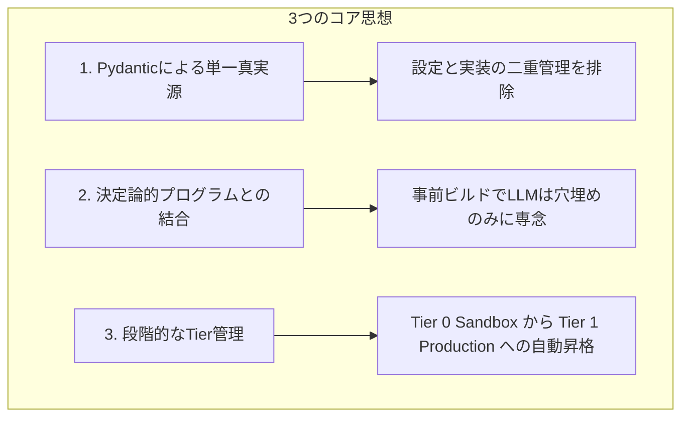
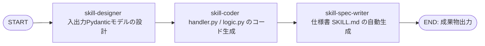

# Self-Evolving EDD Agent
**〜段階的なスキルのTier管理と多言語評価を備えた、Google ADKスキルの自己進化型 評価駆動開発（EDD）エージェント〜**

本プロジェクトは、Google の **Agent Development Kit (ADK) 2.0** の設計思想を追求し、AIエージェントが自律的に新しいスキル（機能）を設計、開発、テスト、評価し、適切な状態管理を経て自身へマウント（統合）する **「自己進化型 評価駆動開発 (Self-Evolving EDD: Evaluation-Driven Development) エージェント」** です。

Kaggle Competition: [Vibe Coding Agents Capstone Project (Freestyle Track)](https://www.kaggle.com/competitions/vibecoding-agents-capstone-project) 提出プロジェクト。

---

## 1. 背景と中核コンセプト (Background & Core Concept)

### 💡 ADKの思想への共感と課題意識
Googleの **ADK 2.0** が提唱する「スキル」と「ノード」によるエージェント構築は、まさにエージェント開発の理想形です。複雑な手順をDAG（非巡回有向グラフ）として構成し、段階的にスキルを適用することで、エージェントは強化学習のオプション（スキル）獲得と非常に近い形で、人間がメンテナンス可能かつ他エージェントに継承可能な「スキル」という形で知識を蓄積できます。

しかし、実際の開発においては大きな障害に直面します。
*   **EDD（評価駆動開発）の難しさ**: AI의 成果物を的確に検証し、ADKの思想に沿ったハーネス（制約）を設計するのは人間にとっても極めて困難です。
*   **実装の散らかりとプロンプト泥沼化**: LLMにリファクタリングを頼むと、共通のインターフェースファイルを破壊したり、ハルシネーションによって動作しないコードが生成されたりします。結果、プロンプトにその場しのぎの制約を書き加え続けるアンチパターンに陥ります。

> [!IMPORTANT]
> **本プロジェクトの結論**
> エージェント開発者が何よりもまず優先して構築すべきなのは、**「評価駆動開発を自律的に行うエージェント」**です。
> 人間の曖昧な指示（Vibe）を受け取り、エージェント自身が安全に設計・実装・テスト・評価を回し、テストをクリアしたスキルだけを自律的に自身の武器（ツール）としてマウント（統合）する。これこそが、本プロジェクトが提案する **「自己進化型 EDD エージェント」** です。

---

## 2. コア設計思想 (Core Design Philosophy)

AIが自身のコードを自律的に書き換えて進化する際、バグコードによって自身がクラッシュするのを防ぐため、以下の **「LLMを制御する強力なハーネス」** を徹底的に実装しています。



1.  **Pydanticによる単一真実源 (Single Source of Truth)**
    *   API仕様（`design.json`）を最初に厳格に定義。設定と実装の二重管理を排除し、ハルシネーションを防ぐハーネスとして機能させます。
2.  **決定論的プログラムとの結合 (事前ビルドの仕組み)**
    *   ワークフロー構築時に、スキル間の入出力の結合ロジックのみをLLMにプログラミング（事前ビルド）させ、残りの結合や実行制御は決定論的なプログラムで書き出します。実行時のLLM依存度を下げ、トークン消費を最小化しつつ確実な結合を実現します。
3.  **段階的なTier管理（サンドボックス制御）**
    *   未テストのスキルは隔離された環境（Tier 0）に置き、すべてのテスト・評価をクリアした安全なスキルのみを本番環境（Tier 1）へマウントします。

---

## 3. 実装スキル一覧 (Skills)

本システムは、開発用と評価用の2つのカテゴリに分類される自律スキル群を連携させることで、新スキルの開発から検証、統合までを完全自動化します。

| スキル名 | 役割 / 機能 | 評価基準に対応する技術的工夫 |
| :--- | :--- | :--- |
| **`skill-designer`** | スキル設計 | ユーザーの要求から入出力Pydanticモデル（`design.json`）を設計し、ハルシネーションを防ぐハーネスとします。 |
| **`skill-coder`** | コード自動生成 | 設計仕様に基づき、`handler.py` と `logic.py` をテンプレートから自動生成します。 |
| **`skill-spec-writer`** | 仕様書（`SKILL.md`）の自動生成 | 確定した設計情報から、親エージェントがロードするための仕様書をMarkdown形式で決定論的に構築します。 |
| **`import-validator`** | 動的インポートおよび構文チェック | 生成された Python コードが構文エラーなく、正常にインポート可能かを実環境で動的にロードして検証します。 |
| **`trigger-evaluator`** | トリガー仕様の静的評価＆テスト生成 | `[The trigger is the first gate]` に従い、業界基準90%のトリガー精度のための4項目を自動チェックし、評価用テストケースを自動生成します。 |
| **`test-executor`** | ADK評価シミュレーションの実行 | ADKの評価エンジンを模したテストスイートを実行し、測定された精度（`accuracy`）が閾値以上であるかを判定します。 |
| **`design-validator`** | 仕様整合性のLLMレビュー | `design.json` と Python ソースコードをロードし、Gemini APIを用いて整合性を静的に検証します。 |

---

## 4. ワークフローエージェント (Workflow Agents)

ワークフローエージェントは、個別の「スキル」をDAG（非巡回有向グラフ）として接続し、多段階の複雑なプロセスをオーケストレーションする上位エージェントです。

### ① `skill-developer` ワークフローエージェント
スキル開発に必要な「設計 -> 実装 -> 仕様書作成」の3つのスキル（ステップ）を順次実行し、新しいスキルを自動生成します。



*   **優れた点**: 
    *   実行時に毎回LLMに接続方法を解決させるのではなく、**事前ビルドの仕組み**を採用しています。
    *   スキル間の入出力結合ロジックのみを LLM に記述させ、残りは決定論的に書き出すため、トークン消費量を最小限に抑えつつ、確実で高速な結合を実現しています。

---

### ② `first-test-runner` ワークフローエージェント
新しく生成されたスキルが最初に評価され、品質合格したスキルのみを本番環境へ自動マウントする品質管理パイプラインです。

```mermaid
flowchart TD
    Start([START: 対象スキル Tier 0 (未テスト)]) --> TrigEval[trigger-evaluator <br/> トリガー評価＆テスト生成]
    TrigEval --> TestExec[test-executor <br/> ADK評価シレーション実行]
    TestExec --> ImportVal[import-validator <br/> インポート＆動的ロードの検証]
    ImportVal --> DesignVal[design-validator <br/> 設計・実装整合性のLLMレビュー]
    DesignVal --> Register[evaluate-and-register-skill <br/> 全テスト結果の総合評価]
    Register -->|全テスト合格| Promote[Tier 1: PRODUCTION 昇格]
    Promote --> Mount[skills.json へ自動マウント]
    Mount --> End([END: 本番利用開始])
```

*   **優れた点**: 
    *   このワークフローを通過しない限り、どれだけ「それらしいコード」が生成されても、エージェントがそれをスキル（ツール）として使うことはできません。システム全体の堅牢性を100%維持する防壁となっています。

---

## 5. 技術的イノベーションとアピールポイント (Technical Innovations)

本プロジェクトが Freestyle トラックにおいて最も主張したい、高い実装品質と技術的工夫は以下の4点です。

### 1️⃣ 段階的なスキルのTier管理 (Skills Tier Management)
未検証のスキルが本番エージェントにロードされてシステム全体がクラッシュするのを防ぐため、`skills_state.json` を用いた動的な状態管理（Tier管理）を導入しています。

*   **`Tier 0 (SANDBOX / 開発中)`**: 
    新規に作成された、または検証前のスキル。本番ロードの対象外として厳格に識別され、エージェントの実行コンテキストには追加されません。
*   **`Tier 1 (PRODUCTION / 本番マウント)`**: 
    `first-test-runner` ワークフローのすべての検証をクリアしたスキル。自動的に `Tier 1` にプロモート（昇格）され、`skills.json` から `exclude` が解除されることで、本番エージェントのツールとして動的にマウントされます。

### 2️⃣ Safe File Tools による共通コードの保護 (Safe Edit / Write)
自動開発エージェントに対してファイルの書き込みや編集を許可する際、LLMが共通のインターフェースファイル（`handler.py` や `models.py`）を勝手に書き換えて全体のインターフェース規格を壊すのを防ぐため、`SafeWriteFileTool` および `SafeEditFileTool` を実装しました。

*   **仕組み**:
    システム管理されたファイル（インターフェース規約定義）へのアクセスをツールレベルで検知・遮断し、エラーメッセージとして **`"Write your custom logic in 'nodes/' directory or 'executor.py' instead."`** を返します。
*   **効果**:
    LLMは、自動生成された共通インターフェースを破壊することなく、ロジック専用ファイル（`nodes` 配下のファイル）の書き込みに専念せざるを得なくなり、エージェントの実装が散らかるのを強力に防止します。

### 3️⃣ 多言語 ROUGE-1 パッチ (HuggingFace Multilingual Monkey Patch)
ADK 2.0 標準の評価エンジンで用いられる `rouge-score` ライブラリは、日本語の「わかち書き（形態素解析）」に対応しておらず、テキストをスペース区切りでトークン化しようとします。そのため、日本語の仕様や出力がどれだけ優れていても、Rouge-1 スコアが極端に低くなり、自動テストで不合格になってしまう問題がありました。

*   **解決策**:
    Python ランタイムの起動時に `bert-base-multilingual-cased` トークナイザを `rouge_score.tokenizers` へ動的に差し替えるモンキーパッチ（[usercustomize.py](file:///workspace/edd-agent-tools/src/edd_agent_tools/run/patch/usercustomize.py)）を実装しました。
*   **効果**:
    日本語テキストに対しても正確なサブワード単位でトークン境界が認識されるようになり、日本語エージェント評価時のテストの信頼性を100%確保しました。これにより、日本語による評価駆動開発（EDD）が正常に機能するようになりました。

### 4️⃣ 共通ランナー（`edd-run`）によるスキーマ駆動CLI
開発者がコマンドラインから直接デバッグ・実行できるように、`edd-agent-tools` を通じて共通CLIランナー（`edd_agent_tools.run`）提供しています。これにより、以下のメリットが得られます。
*   **JSONエスケープ地獄の排除**: 引数はすべて通常のフラットなオプション（`--param_a value`）で指定できます。
*   **自動 `--help`**: `python3 -m edd_agent_tools.run my-skill --help` を実行するだけで、Pydanticモデルの定義に基づいた引数説明（`Field(description=...)` から抽出）が自動出力されます。
*   **バリデーションの即時性**: 不正な引数や型の間違いは、ビジネスロジックを実行する前にCLIのバリデータレベルでエラーになります。

また、これら共通の評価駆動開発支援ツール群を `edd-agent-tools` パッケージとして開発し、PIPで公開（[PyPI: edd-agent-tools](https://pypi.org/project/edd-agent-tools/)）しました。

---

## 6. 実証：自己生成によるドッグフーディング (Dogfooding Proof)

> [!TIP]
> **本リポジトリの実証性**
> 本プロジェクトのリポジトリ（[src/skills](file:///workspace/src/skills) や [src/agents](file:///workspace/src/agents)）に含まれるスキルの大半は、**この自己進化型EDDエージェントによって実際に自律生成されたもの**です。
> 人間が「○○をするためのスキルを追加して」と曖昧な要件（Vibe）をエージェントに提示し、エージェントが設計・実装・テストを行い、テストに合格して `Tier 1` に昇格し、自動的に自身の武器としてマウントされるプロセスを繰り返すことで、このリポジトリ自体が構築されました。

---

## 7. まとめと今後の展望

本プロジェクトが構築した **「自己進化型 EDD エージェント」** は、Google ADK 2.0 の仕様を最大限にリスペクトしながら、実運用での課題（二重管理、未検証コードによるクラッシュ、多言語評価のバグ）に対する堅牢な防壁となるシステムです。

このシステムを導入することで、開発者はエージェントに対して自然言語で依頼するだけで、裏側で安全な設計・検証・テスト・評価（多言語対応）がすべて自律的に回り、合格したものだけが新しい武器（ツール）としてエージェント自身にマウントされるという、真の **Vibe Coding エコシステム** が実現しています。

今後の展望として、自動生成されたコードのリファクタリングループの追加や、エラー時のトレースログに基づく自動修正プロンプトの洗練化を進めていきます。
