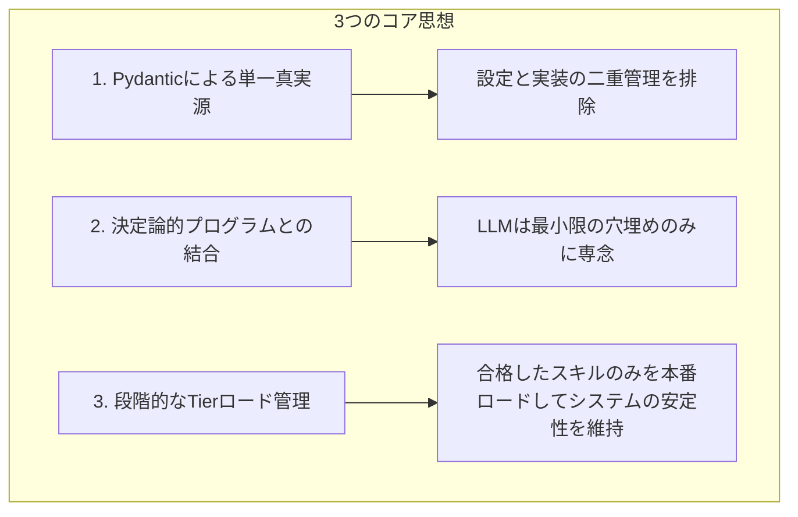

# Self-Evolving EDD Agent
**〜段階的なスキルのTier管理と多言語評価を備えた、Google ADKスキルの自己進化型 評価駆動開発（EDD）エージェント〜**

本プロジェクトは、Google of **Agent Development Kit (ADK) 2.0** の設計思想を追求し、AIエージェントが自律的に新しいスキル（機能）を設計、開発、テスト、評価し、適切な状態管理を経て自身へマウント（統合）する **「自己進化型 評価駆動開発 (Self-Evolving EDD: Evaluation-Driven Development) エージェント」** です。

---

## 1. コア設計思想 (Core Design Philosophy)

AIに自律的にコードを書かせ、自身のスキルとして追加させる（自己進化）場合、不完全なコードやバグがエージェント自身をクラッシュさせ、復旧不能に陥らせるリスクが常に存在します。本プロジェクトは、この課題を解決するために**「LLMを制御するハーネス（防壁・制約）」および「状態（Tier）管理」**を徹底的に実装しています。



### ① Pydanticによる単一真実源 (Single Source of Truth)
ADK 2.0におけるスキルの引数定義などの仕様（スキーマ）を、設定ファイル（`design.json`）と Python 実装コードの双方に手動で定義すると、仕様の同期が崩れてエラーの原因になります。
本プロジェクトでは、**Pythonコード（Pydanticモデル）を唯一の真実**とし、仕様書（`SKILL.md`）の引数テーブルやCLIの引数パーサーはすべてコードから自動構築します。

### ② 決定論的ハーネスによるハルシネーションの完全排除
LLMに複雑なロジックやファイル生成、仕様書の作成を一度に実行させるとハルシネーションが頻発します。
本プロジェクトでは、まず仕様定義などの「設計」を `skill-designer` に行わせ、その構造化されたメタデータを使って決定論的プログラムが成果物の大枠を自動生成します。LLMは決定された成果物を「穴埋め」するだけで良いため、品質が極めて安定します。

### ③ 関心の分離とカプセル化 (Separation of Concerns)
スキルは「モジュール化されたカプセル（ブラックボックス）」として設計されています。
親エージェントからは、パラメータを渡せば自動的に結果が返ってくる「抽象化されたツール（関数）」として見せることで、エージェント内部の構成ファイルやサブプロセスの仕組みを意識させず、再利用性とメンテナンス性を最大化しています。

---

## 2. 実装スキル一覧 (Skills)

本システムは、以下の自律スキル群を連携させることで、新スキルの開発から検証、統合までを完全自動化します。

| スキル名 | 役割 | 優れている点・品質管理上の工夫 |
| :--- | :--- | :--- |
| **`skill-designer`** | 新スキルの入出力および目的の設計 | 要求プロンプトから目的、パラメータ（Pydanticスキーマ）を綺麗に設計。 |
| **`design-validator`** | 仕様書と実装コードの整合性検証 | `design.json` と Python ソースコード（`models.py`, `handler.py`, `workflow.py` 等）をロードし、Gemini APIを用いて整合性を静的に検証します。 |
| **`skill-spec-writer`** | 仕様書（`SKILL.md`）の自動生成 | 確定した設計情報から、親エージェントがロードするための仕様書を Markdown 形式で決定論的に構築します。 |
| **`skill-coder`** | 設計に基づく実装コードの自動生成 | テンプレートをもとに、インターフェース層である `handler.py` とビジネスロジックである `logic.py` を生成します。 |
| **`import-validator`** | 動的インポートおよび構文チェック | 生成された Python コードが構文エラーなく、依存関係を満たして正常にインポート可能かを実環境で動的ロードして検証します。 |
| **`trigger-evaluator`** | トリガー仕様の静的評価＆テスト生成 | `[The trigger is the first gate]` に従い、業界基準90%のトリガー精度のための4項目を自動チェックし、評価用テストケースを自動生成します。 |
| **`test-executor`** | ADK評価シミュレーションの実行 | ADKの評価エンジンを模したテストスイートを実行し、測定された精度（`accuracy`）が閾値（`threshold_accuracy`）以上であるかを判定します。 |

---

## 3. ワークフロー (Workflows)

ワークフローは複数のスキルを非巡回有向グラフ（DAG）として繋ぐことで、より複雑なタスクを段階的に解決します。

### ① `skill-developer` ワークフロー
新スキルの設計からコード生成、仕様書作成までの開発ライフサイクルを自動化します。


- **優れた点**: 
  - 実行時に毎回LLMに接続方法を解決させるのではなく、**事前ビルドの仕組み**を採用しています。
  - スキル間の入出力結合ロジックのみを LLM に記述させ、残りは決定論的に書き出すため、トークン消費量を最小限に抑えつつ、確実で高速な結合を実現しています。

---

### ② `first-test-runner` ワークフロー
自動生成されたスキルを徹底的にテストし、品質合格したスキルのみを本番環境へ自動マウントする品質管理パイプラインです。

```mermaid
flowchart TD
    Start([START: 対象スキル Tier 0 (未テスト)]) --> TrigEval[trigger-evaluator <br/> トリガー評価＆テスト生成]
    TrigEval --> TestExec[test-executor <br/> ADK評価シミュレーション実行]
    TestExec --> ImportVal[import-validator <br/> インポート＆動的ロードの検証]
    ImportVal --> DesignVal[design-validator <br/> 設計・実装整合性のLLMレビュー]
    DesignVal --> Register[evaluate-and-register-skill <br/> 全テスト結果の総合評価]
    Register -->|全テスト合格| Promote[Tier 1: PRODUCTION 昇格]
    Promote --> Mount[skills.json へ自動マウント]
    Mount --> End([END: 本番利用開始])
```

- **優れた点**: 
  - このワークフローを通過しない限り、どれだけ「それらしいコード」が生成されても、エージェントがそれをスキル（ツール）として使うことはできません。システム全体の堅牢性を100%維持する防壁となっています。

---

## 4. 徹底した品質管理の工夫とアピールポイント

本プロジェクトにおける、自動生成物の品質を担保するための3大イノベーションです。

### 1️⃣ 段階的なスキルのTier管理 (Skills Tier Management)
未検証のスキルが本番エージェントにロードされてシステム全体がクラッシュするのを防ぐため、`skills_state.json` を用いた動的な状態管理（Tier管理）を導入しています。

- **`Tier 0 (SANDBOX / 開発中)`**: 
  新規に作成された、または検証前のスキル。本番ロードの対象外として厳格に識別され、エージェントの実行コンテキストには追加されません。
- **`Tier 1 (PRODUCTION / 本番マウント)`**: 
  `first-test-runner` ワークフローのすべての検証をクリアしたスキル。自動的に `Tier 1` にプロモート（昇格）され、`skills.json` から `exclude` が解除されることで、本番エージェントのツールとして動的にマウントされます。

### 2️⃣ Safe File Tools による共通コードの保護 (Safe Edit / Write)
自動開発エージェントに対してファイルの書き込みや編集を許可する際、LLMが共通のインターフェースファイル（`handler.py` や `models.py`）を勝手に書き換えて全体のインターフェース規格を壊すのを防ぐため、`SafeWriteFileTool` および `SafeEditFileTool` を実装しました。

- **仕組み**:
  システム管理されたファイル（インターフェース規約定義）へのアクセスをツールレベルで検知・遮断し、エラーメッセージとして **`"Write your custom logic in 'nodes/' directory or 'executor.py' instead."`** を返します。
- **効果**:
  LLMは、自動生成された共通インターフェースを破壊することなく、ロジック専用ファイル（`nodes` 配下のファイル）の書き込みに専念せざるを得なくなり、エージェントの実装が散らかるのを強力に防止します。

### 3️⃣ 多言語 ROUGE-1 パッチ (HuggingFace Multilingual Monkey Patch)
ADK 2.0 標準の評価エンジンで用いられる `rouge-score` ライブラリは、日本語の「わかち書き（形態素解析）」に対応しておらず、テキストをスペース区切りでトークン化しようとします。そのため、日本語の仕様や出力がどれだけ優れていても、Rouge-1 スコアが極端に低くなり、自動テストで不合格になってしまう問題がありました。

- **解決策**:
  Python ランタイムの起動時に `bert-base-multilingual-cased` トークナイザを `rouge_score.tokenizers` へ動的に差し替えるモンキーパッチ（`usercustomize.py`）を実装しました。
- **効果**:
  日本語テキストに対しても正確なサブワード単位でトークン境界が認識されるようになり、日本語エージェント評価時のテストの信頼性を100%確保しました。これにより、日本語による評価駆動開発（EDD）が正常に機能するようになりました。

---

## 5. 共通ランナー（edd-run）によるスキーマ駆動CLI

開発者がコマンドラインから直接デバッグ・実行できるように、`edd-agent-tools` を通じて共通CLIランナー（`edd_agent_tools.run`）を提供しています。

### メリット
- **JSONエスケープ地獄の排除**: 引数はすべて通常のフラットなオプション（`--param_a value`）で指定できます。
- **自動 `--help`**: `python3 -m edd_agent_tools.run my-skill --help` を実行するだけで、Pydanticモデルの定義に基づいた引数説明（`Field(description=...)` から抽出）が自動出力されます。
- **バリデーションの即時性**: 不正な引数や型の間違いは、ビジネスロジックを実行する前にCLIのバリデータレベルでエラーになります。

### 実行例
```bash
# skill-developer ワークフローを実行する例
python3 -m edd_agent_tools.run skill-developer \
  --prompt "インターネットから天気情報を取得し、要約して返すスキル" \
  --skill "weather-summary-skill" \
  --output_dir "src/skills/weather-summary-skill"
```

---

## 6. まとめと今後の展望

本プロジェクトが構築した **「自己進化型 EDD エージェント」** は、Google ADK 2.0 の仕様を最大限にリスペクトしながら、実運用での課題（二重管理、未検証コードによるクラッシュ、多言語評価のバグ）に対する堅牢な防壁となるシステムです。

このシステムを導入することで、開発者はエージェントに対して「○○をするためのスキルを追加して」と自然言語で依頼するだけで、裏側で安全な設計・検証・テスト・評価（多言語対応）がすべて自律的に回り、合格したものだけが新しい武器（ツール）としてエージェント自身にマウントされるという、真の **Vibe Coding エコシステム** が実現しています。
