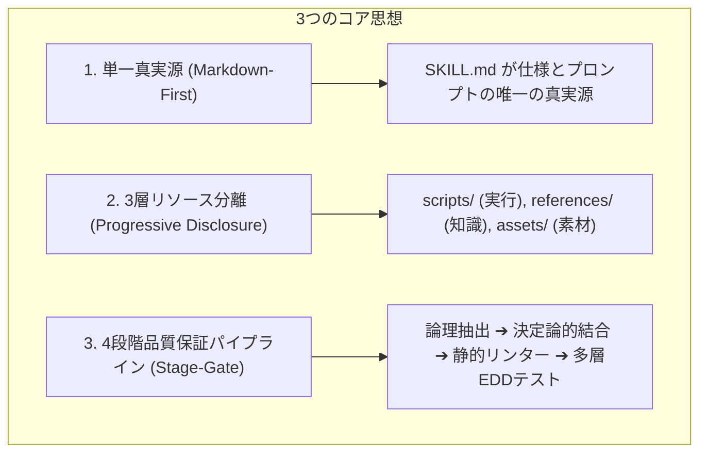

# Self-Evolving EDD Agent
**〜Anthropic公式標準の Markdown-First & Progressive Disclosure を備えた、Google ADKスキルの自己進化型 評価駆動開発（EDD）エージェント〜**

本プロジェクトは、Google の **Agent Development Kit (ADK) 2.0** および Anthropic の **Progressive Disclosure（段階的情報開示）** 設計思想を融合し、AIエージェントが自律的に新しいスキル（機能）を設計、開発、テスト、評価し、適切な Tier 状態管理を経て自身へマウント（統合）する **「自己進化型 評価駆動開発 (Self-Evolving EDD: Evaluation-Driven Development) エージェント」** です。

Kaggle Competition: [Vibe Coding Agents Capstone Project (Freestyle Track)](https://www.kaggle.com/competitions/vibecoding-agents-capstone-project) 提出プロジェクト。

---

## 1. 背景と中核コンセプト (Background & Core Concept)

### 💡 ADKの思想への共感と課題意識
Googleの **ADK 2.0** が提唱する「スキル」によるエージェント構築は、エージェント開発の理想形です。段階的にスキルを適用することで、エージェントは強化学習のオプション（スキル）獲得と非常に近い形で、人間がメンテナンス可能かつ他エージェントに継承可能な「スキル」という形で知識を蓄積できます。

しかし、従来のスキル開発では以下のような課題がありました：
*   **多層ボイラープレートの肥大化**: 多層ラッパー（`models.py`, `handler.py`, `executor.py`, `nodes/`）が乱立し、トークン消費と保守負荷が増大。
*   **EDD（評価駆動開発）の難しさ**: AIの生成物を的確に検証し、ハルシネーションを防ぐハーネス（制約）を設計するのは人間にとっても極めて困難。

> [!IMPORTANT]
> **本プロジェクトの結論**
> エージェント開発者が何よりもまず優先して構築すべきなのは、**「評価駆動開発を自律的に行うメタエージェント」**です。
> 人間の自然言語指示（Vibe）を受け取り、エージェント自身が安全に **Markdown-First** かつ **3層リソース分離（Progressive Disclosure）** でスキルを生成・テスト・評価し、テストをクリアしたスキルだけを自律的に自身の武器（ツール）としてマウント（統合）する。これこそが、本プロジェクトが提案する **「自己進化型 EDD エージェント」** です。

---

## 2. コア設計思想 (Core Design Philosophy)



1.  **単一真実源の原則 (Markdown-First)**
    *   スキルの仕様定義はすべて `SKILL.md`（YAML Frontmatter + Markdown）に一元化し、可読性と保守性を最大化。
2.  **3層リソース分離 (Progressive Disclosure)**
    *   コンテキストウィンドウを圧迫しない3層リソース構造：
        - `scripts/`: 直接実行可能な決定論的スクリプト
        - `references/`: LLMがオンデマンドで読む詳細ドキュメント・スキーマ
        - `assets/`: 成果物にコピー・流用するためのテンプレート・素材
3.  **4段階品質保証パイプライン (Stage-Gate)**
    *   **Stage 1**: `SkillLogicDraft` (Pydanticモデル) による論理・決定木・リソース計画の構造化抽出
    *   **Stage 2**: `SkillTemplateEngine` による決定論的テンプレートレンダリング
    *   **Stage 3**: `SkillValidator` による静的リンター（構文・実在整合性・Imperative文体）& 自動修復ループ
    *   **Stage 4**: 多層EDDテスト（Trigger 90%精度 + Contract + Golden + Trajectory + Judge）による Tier 昇格防壁

---

## 3. 実装スキル一覧 (Skills & Workflows)

### 🛠 メタスキル (Core Meta-Skills)
| スキル名 | 役割 / 機能 | 特徴 |
| :--- | :--- | :--- |
| **`skill-creator`** | スキル自律生成エンジン | 4段階品質保証パイプラインに基づき、自然言語要件から `SKILL.md` と3層リソース（`scripts/`, `references/`, `assets/`）を一括生成・静的検証。 |
| **`skill-evaluator`** | 統合評価＆Tier昇格ゲートキーパー | 多層テストセット生成（Trigger, Contract, Golden, Judge, Trajectory, Adversarial）、シミュレーション実行、および Tier 1〜3 昇格判定をワンストップで実行。 |
| **`skill-diagnoser`** | テスト失敗診断 & 改善計画策定 | 失敗レポートログを分析し、`spec`, `script`, `reference`, `test_case` の3層リソース改善計画（`ImprovementPlan`）を自律出力。 |
| **`skill-optimizer`** | 自律改善・自己進化ループ | テスト ➔ 診断 ➔ 差分修正 ➔ 再テスト ➔ 上位連鎖回帰テスト（Cascade Testing）を完全自動でループ実行。 |
| **`skill-planner`** | 要件分析 & 開発計画策定 | ユーザー要件を分析し、新規作成・既存更新・ワークフロー連携の最適ルートを判定。 |

---

## 4. クイックスタート (Quick Start)

### パッケージのインストール
```bash
pip install -e edd-agent-tools
```

### CLI によるスキル操作
```bash
# 1. 新規スキル雛形の初期化
python -m edd_agent_tools.skills.cli init my-new-skill --pattern workflow

# 2. 静的バリデーションの実行
python -m edd_agent_tools.skills.cli validate src/skills/my-new-skill

# 3. 配布用 ZIP のパッケージング
python -m edd_agent_tools.skills.cli package src/skills/my-new-skill
```

### Python API による自律スキル生成
```python
from src.skills.skill_creator.scripts.main import create_skill

result = create_skill(
    prompt="PDFファイルの回転・結合・テキスト抽出を行う pdf-tools スキルを作成してください。",
    name="pdf-tools",
    pattern="workflow"
)
print(result)
```

### テストスイートの実行
```bash
pytest tests/ -v
```
