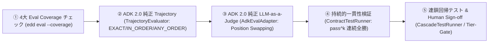

# ADKエージェントテスト自動化設計仕様 (Test Architecture)

本ドキュメントでは、Google ADK (Agent Development Kit) 2.0 および Anthropic 標準に準拠したスキルの品質保証 (QA) を自動化するための、テストケース設計、シミュレーション実行、ADK 評価統合、および Tier 昇格ゲートキーパーの標準化設計について記述します。

---

## 1. 統合評価・自己改善スキル (`skill-evolver`) と EDD 多層テスト設計

### 解決策: 統合自己改善スキル (`skill-evolver`) への一元化
すべてのテスト実行・失敗診断・自己修復・連鎖回帰・Tier 昇格判定を、単一の自己完結型メタスキル **[`skill-evolver`](file:///workspace/src/skills/skill-evolver)** および統合 CLI `edd` に集約しました。

```mermaid
graph TD
    Spec[SKILL.md / scripts] -->|1. Analyze & Design| Gen["Test Authoring (references/eval_framework.md)"]
    Gen -->|2. Save Asset (SSOT)| File[(tests/{skill_name}.test.json)]
    File -->|3. Read & Run| Exec["skill-evolver (edd eval)"]
    Env[LocalWorkspaceEnv (Git Sandbox)] -->|4. Assert & Run| Exec
    Exec -->|5. Aggregate & Report| Result[(tests/results/latest_report.json)]
    Result -->|6. Diagnose| Diag["skill-evolver (edd diagnose)"]
    Result -->|7. Gating & Promotion| Gate["skill-evolver (edd tier-gate / edd optimize)"]
```

1.  **テスト設計・配置フェーズ (EDD Inversion & ADK 2.0 EvalSet SSOT)**:
    仕様定義（`SKILL.md` や `scripts/`）を先行決定する前に、Google ADK 2.0 公式 `EvalSet` スキーマ（`eval_set_id`, `eval_cases`, `conversation`, `Invocation`, `intermediate_data.tool_uses`, `rubrics`）の評価ケース（正例3件＋負例3件の計6件、白書 Section 4 Page 22 必須要件）を策定し、`tests/<skill_name>.test.json` に**単一真実源（SSOT）アセットとして保存**します（Google ADK 2.0 公式ディレクトリ自動探索規約適合）。契約テスト・トリガー判定・ツール軌跡・ルーブリック採点の全データがこの単一ファイルに統合されます。
2.  **評価実行フェーズ (`edd eval`)**:
    保存された ADK 公式 `EvalSet` をロードし、隔離されたサンドボックス環境（`LocalWorkspaceEnv`）上でテストを実行・評価します。Google ADK 2.0 純正の `AgentEvaluator` や `TrajectoryEvaluator` / `ResponseEvaluator` / `RubricBasedFinalResponseQualityV1Evaluator` と直結動作します（`adk-eval` は透過エイリアス）。結果は `latest_report.json` に構造化ログとして永続化されます。
3.  **失敗診断・自己修復フェーズ (`edd diagnose`)**:
    テスト失敗時に構造化されたコンテキスト（SKILL.md、関連スクリプト、スタックトレース）を抽出し、エージェントが自律的にプロンプトやスクリプトを自己修復します。
4.  **Tier 昇格ゲートキーパーフェーズ (`edd tier-gate` / `edd optimize`)**:
    Tier 階層（Tier 1: READ_ONLY, Tier 2: DRAFT_ONLY, Tier 3: ACTION_ALLOWED）に応じた防壁テスト、上位依存スキルの連鎖回帰テスト、および Human Sign-off を一括検証し、合格時に `SkillsState` へ登録・昇格させます。


---

## 2. 次世代多層評価エンジン仕様



### ① 白書（May 2026）4大 Eval Coverage Checklist (`edd eval --coverage`)
- **Trigger**: 正例および負例テストケースで発火精度 90% 以上。
- **Execution**: 決定論的契約テスト 100% 合格、および期待される出力とツール軌跡の完全一致。
- **Regression**: スキル追加・更新による既存機能の回帰劣化ゼロ（0 drops）。
- **Token Budget**: 5〜15 スキルが同時展開された高トークン環境下での Context Rot 防止。

### ② Google ADK 2.0 純正 TrajectoryEvaluator 完全一本化 (`AdkEvalAdapter`)
- 手書き軌跡比較ループ（車輪の再発明）および独自フォールバックを完全撤廃し、ADK 2.0 純正の `TrajectoryEvaluator` および `ToolTrajectoryCriterion` に 100% 一本化。
- テストケースおよびエージェント実行におけるツール呼び出しは、ADK 2.0 純正の **`run_skill_script`**（args: `skill_name`, `file_path`, `args`, `positional_args`）を第1級の標準（Primary Standard）として採用。
- 3大モード：`EXACT`（完全一致）、`IN_ORDER`（順序付き部分列）、`ANY_ORDER`（順序不問）。

### ③ Google ADK 2.0 純正 LLM-as-a-Judge 主軸化 & 責務分離 (`AdkEvalAdapter`)
- 表現揺らぎに弱い ROUGE-1 表層文字列一致（`response_match_score`）への過度依存を排し、Google ADK 2.0 公式の `AgentEvaluator` および `RubricBasedFinalResponseQualityV1Evaluator`（`rubric_based_final_response_quality_v1`）を最終回答品質評価の主軸として採用。
- ツール呼び出し・引数（`positional_args` / `args`）・順序の厳密検証は `tool_trajectory_avg_score`（Trajectory レイヤー）に集約し、`rubric` は会話フィラーの排除や意図充足（Response レイヤー）に特化させる責務分離を徹底。
- 参照回答とモデル回答の位置を反転させて 2 回推論する **Position Swapping** により順序バイアスを中和。
- 通常テスト・CI は決定論的契約テスト（`ContractTestRunner`）および Trajectory Evaluator でミリ秒単位で高速・安定実行し、ライブ検証時のみ Gemini API リモート推論を実行。

### ④ Google ADK 2.0 純正 RunSkillScriptTool 委譲 (`SkillPackage.execute_script`)
- 自前の一時展開スクリプト生成コード（車輪の再発明）を完全削除。
- `SkillPackage.execute_script` は、Google ADK 2.0 純正の `SkillToolset` 内に配備されている公式 `RunSkillScriptTool`（`run_skill_script`）および `UnsafeLocalCodeExecutor` に直接委譲し、公式の実行ライフサイクル（一時展開・依存解決・環境変数注入）を 100% 透過活用。
- 生 `subprocess.run` やプライベート属性の裏口ハックを排除し、安全で決定論的なスクリプト実行を完全保証。

### ⑤ 決定論的 Black-box CLI 契約テスト (`ContractTestRunner`)
- **Black-box 実行**: Python 内部コードを直接インポートせず、CLI インターフェース（`cli_args`）経由でサブプロセス実行。
- **$pass^k$ (Sustained Reliability)**: 1 回のラッキー合格を排除し、指定された $k$ 回連続実行（例: $k=3$）ですべて合格することを要求。

### ⑥ Co-loaded 複数スキル共存ベンチマーク (`CoLoadedEvalRunner`)
- 5〜15 スキルが同時マウントされた高トークン負荷環境下で、スキルのルーティング精度および Context Rot の有無を検証。

### ⑦ Human Sign-off ゲート (`SkillOptimizer` / `cli.py`)
- 不可逆操作を伴う Tier 3 昇格時に、人間の明示的承認（`--yes` / `human_approved=True`）を必須とする安全ガバナンスプロトコル。

---

## 3. 仮想環境の隔離と依存性注入 (Dependency Injection)

テスト実行器に対して、環境の操作能力を抽象化した **`WorkspaceEnvProtocol`**（`LocalWorkspaceEnv` サンドボックス）を外部から注入 (DI) する設計を採用します。

```mermaid
graph LR
    Evaluator[skill-evolver] -->|1. Create Env| Env[LocalWorkspaceEnv (Git Sandbox)]
    Evaluator -->|2. Run Tests| Runner[ContractTestRunner / SimulationEvalRunner / AdkEvalAdapter]
    Runner -->|3. Safe Interaction| Env
    Env -->|4. Safe Read/Write/Test| Files[(Virtual Filesystem)]
```

*   **環境の差し替え可能性 (Pluggability)**:
    テスト実行コードを変更することなく、実環境で実行する `RealWorkspaceEnv` や、テスト完了後に自動ロールバックを行う Git 管理下の `LocalWorkspaceEnv`（サンドボックス）を動的に切り替え可能。
*   **安全性の確保**:
    テスト実行中に発生したすべてのファイルの作成・変更・削除は仮想環境によって追跡され、実行後に完全にロールバックされるため、開発環境を汚さずに安全に何度でもテストを実行可能。
