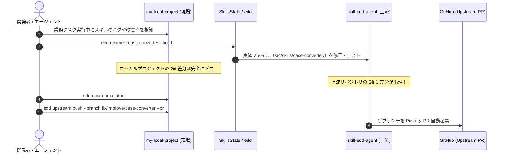

# 外部プロジェクト連携ガイド (Workspace & Layered Linking Guide)

本ドキュメントは、ローカルの業務プロジェクト（別 Git リポジトリ）から `skill-edd-agent` の共通スキル資産を簡単・透過的に利用し、現場でのスキル改善結果をローカルの Git を一切汚さずに上流リポジトリへ即座に還元・PR 作成するための **「Workspace / Layered 参照方式」** の公式ガイドです。

---

## 1. アーキテクチャ概要 (The Multi-Repo Pattern)

モダンソフトウェアエコシステム（Go の `go.work`、Node.js の `npm link`、Python の `pip -e`）のベストプラクティスに基づき、**「Git リポジトリは完全に分離し、ファイルシステム上で透過的にリンクする」** 疎結合モデルを採用しています。

```
/your-machine/
├── skill-edd-agent/                   <-- 【上流Git】ハーネス & 公式スキル集
│   ├── .git/                          <-- ★上流スキルの改善差分は「ここだけ」に出る
│   ├── edd-agent-tools/
│   └── src/skills/
│       ├── case-converter/            <-- 公式スキル実体
│       └── ...
│
└── my-local-project/                  <-- 【現場Git】業務プロジェクト
    ├── .git/                          <-- ★業務コードと固有スキルのみ追跡（差分ゼロ）
    ├── src/ (業務コード)
    ├── .gitignore                     <-- .edd.json を除外
    ├── .edd.json                      <-- 上流への参照ポインタ（たった1行）
    └── skills/                        <-- このプロジェクト固有のローカルスキル
        └── my-company-tool/
```

### 3 大メリット
1. **ローカルプロジェクトの Git 差分ゼロ (Zero-Pollution)**:
   上流スキルのコードや設定がローカルプロジェクトの Git 履歴に一切混入しません。
2. **現場での自律進化 (Field-Driven Evolution)**:
   業務コンテキストでエージェントを動かしながら、スキルのプロンプト（`SKILL.md`）やスクリプトを安全に改善できます。
3. **即時 Push & Pull Request (Frictionless Contribution)**:
   改善された差分は上流リポジトリ（`skill-edd-agent`）のワーキングツリーに直接現れるため、そのままブランチを切って GitHub へプッシュ・PR できます。

---

## 2. クイックスタート (たったの 2 ステップ)

### ステップ 1: ローカルプロジェクトでリンク実行
業務プロジェクトのルートディレクトリで、`edd link` コマンドを実行します：

```bash
cd /path/to/my-local-project

# 上流の skill-edd-agent リポジトリをリンク
edd link /path/to/skill-edd-agent
```

**裏側で自動実行されること:**
* 上流リポジトリ内のスキルディレクトリ（`src/skills`）を自動検出。
* ローカルプロジェクト直下に `.edd.json` を生成。
* ローカルプロジェクトの `.gitignore` に `.edd.json` を自動追記。

### ステップ 2: リンク状態と利用可能スキルの確認
`edd status` を実行して、認識されているスキルを確認します：

```bash
edd status
```

**出力例:**
```text
==================================================
  🛠️  EDD Workspace Status                         
==================================================
Project Root: /path/to/my-local-project
Upstream Repo: /path/to/skill-edd-agent
Upstream Skills Dir: /path/to/skill-edd-agent/src/skills
Linked At: 2026-09-07T10:50:00Z
Upstream Git: https://github.com/magic-sword/skill-edd-agent.git

Available Skills (9):
  - case-converter            Tier 1 (READ_ONLY     ) [Upstream] -> /path/to/skill-edd-agent/src/skills/case-converter
  - markdown-table-formatter  Tier 1 (READ_ONLY     ) [Upstream] -> /path/to/skill-edd-agent/src/skills/markdown-table-formatter
  - secret-sanitizer          Tier 3 (ACTION_ALLOWED) [Upstream] -> /path/to/skill-edd-agent/src/skills/secret-sanitizer
  - my-company-tool           Tier 1 (READ_ONLY     ) [Local]    -> /path/to/my-local-project/skills/my-company-tool
==================================================
```
ローカル固有スキル（`[Local]`）と上流スキル（`[Upstream]`）がシームレスに認識されます。

---

## 3. 現場での自律スキル改善と Git 還元フロー

業務プロジェクトでエージェントを稼働させている際、上流スキル（例: `case-converter`）に改善点や未知のエッジケースが見つかった場合のライフサイクルです。



### コマンド操作例

#### 1. 上流の変更差分を確認する
ローカルプロジェクトのディレクトリにいながら、上流リポジトリの Git 状況を確認できます：

```bash
# 差分ステータス確認
edd upstream status

# 具体的な Git diff の確認
edd upstream diff
```

#### 2. 上流リポジトリへブランチ作成・プッシュ・PR 起票
```bash
# ブランチを作成して上流へプッシュ（GitHub CLI があれば PR も自動作成）
edd upstream push --branch fix/improve-case-converter --message "fix(case-converter): add boundary case handling" --pr
```

もちろん、別ターミナルで `cd /path/to/skill-edd-agent` して、通常の `git` コマンドでコミット・プッシュしていただくことも可能です。

---

## 4. リンクの解除 (Unlink)

上流スキルのリンクを解除し、独立したスタンドアローン状態に戻すには以下を実行します：

```bash
edd unlink
```

---

## 5. モードの使い分け（一般配布 vs 開発者リンク）

| 用途 | コマンド | 特徴 |
| :--- | :--- | :--- |
| **開発者モード (Workspace Link)** | `edd link <path>` | 上流リポジトリを直接参照。現場で直した結果が即座に上流の Git 差分になり、Push/PR が可能。 |
| **一般配布モード (Skill Add)** | `edd add <skill>` | スキルのソースコードを自リポジトリにコピーして完全所有（自プロジェクトの Git にコミット）。 |

チーム開発や業務プロジェクトの現場でスキルを育て、その成果を世界中のエージェント基盤へ安全に還元するベストプラクティスとして、ぜひ本機能をご活用ください。
