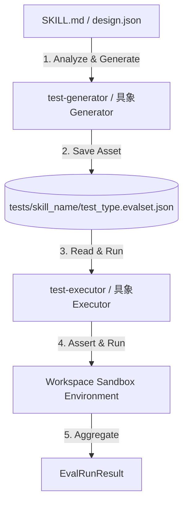
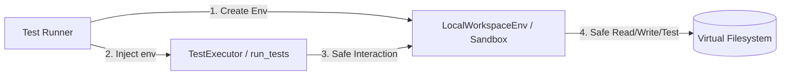

# ADKエージェントテスト自動化設計仕様 (Test Architecture)

本ドキュメントでは、ADK (Agent Development Kit) エージェントにおけるスキルの品質保証 (QA) を自動化するための、テストケース生成 (Generator) と実行 (Executor) の標準化設計について記述します。

---

## 1. Generator-Executor ペアリングパターン (関心の完全分離)

### 課題
LLMを用いたテストケースの生成は、APIトークンコストが高く、かつ確率的（非決定論的）な性質を持っています。テストケースの生成と実行を一体化させてしまうと、以下の問題が発生します。
*   テスト実行のたびに高額なLLM利用料金が発生する。
*   テスト結果が毎回変わり、バグの再現やデバッグ（回帰テスト）が困難になる。

### 解決策
テストケースの **「生成 (Generator)」** と **「実行 (Executor)」** を完全に分離する「ペアリングパターン」を採用します。



1.  **生成 (Generator) フェーズ**:
    仕様定義（`SKILL.md` や `design.json`）を基に、正常系・異常系・境界値テストケースをLLMやルールベースで構築します。生成されたテストケースは、プロジェクトの `tests/[対象スキル名]/[対象スキル名]_[test_type].evalset.json` に**物理的なアセットファイルとして保存**します。このファイルは Git でバージョン管理します。
2.  **実行 (Executor) フェーズ**:
    保存された JSON アセットファイルをロードし、隔離されたサンドボックス環境（`WorkspaceEnvProtocol`）上でテストを実行・評価します。アセットを再利用するため、**実行フェーズは何度繰り返しても 100% 決定論的（再現可能）かつ高速・低コスト**で実行できます。

---

## 2. プラグイン型ディスパッチアーキテクチャ (拡張性の担保)

### 課題
テストのパターンは、単体テスト（`schema`）、トリガー/インテント判定（`trigger`）、対抗的テスト/セキュリティテスト（`redteam`）など多岐にわたり、将来的に拡張される予定です。
すべてのテスト判定ロジックを単一の実行モジュールに実装すると、コードが肥大化し、**OCP（開放閉鎖の原則）**に反して保守性が低下します。また、別プロジェクトへの持ち運びも困難になります。

### 解決策
最上位の `test-generator` および `test-executor` を**動的ディスパッチャー（ルーター）**として構築します。

*   ユーザーやワークフローは、パラメータ `test_type`（例: `"schema"`, `"trigger"`, `"redteam"`）を指定してディスパッチャーを呼び出します。
*   ディスパッチャーは `SkillsState` から対応する具象ペアスキル（例: `schema-test-generator` と `schema-test-executor`）を動的解決してロードし、処理を委譲（ディスパッチ）します。
*   新しいテストパターンを追加する際は、最上位ディスパッチャーのコードを一切変更することなく、**新しいペアスキルを `src/skills/` に新規追加するだけで拡張**できます。

---

## 3. テスト共通インターフェース規約 (Protocol)

動的ロードを保証するため、すべての具象テストスキルは `edd-agent-tools.evaluation` で定義された以下の `Protocol` 契約を満たすモジュール関数（`scripts/__init__.py` から `__all__` でエクスポートされた関数）を公開します。

### A. TestGenerator 共通規約
```python
@runtime_checkable
class TestGenerator(Protocol):
    def generate_tests(self, skill_name: str, output_path: str) -> bool:
        """指定されたスキルの仕様からテストケースを生成し、指定パスに保存します。
        
        Args:
            skill_name: テストケース生成対象の論理スキル名。
            output_path: 生成結果を保存する *.evalset.json の物理パス。
            
        Returns:
            成功した場合は True、失敗した場合は False。
        """
        ...
```

### B. TestExecutor 共通規約
```python
@runtime_checkable
class TestExecutor(Protocol):
    def run_tests(self, skill_name: str, eval_set_path: str, env: WorkspaceEnvProtocol) -> EvalRunResult:
        """指定されたテストケースファイルを読み込み、環境上でテストを実行して結果を返します。
        
        Args:
            skill_name: テスト実行対象 of 論理スキル名。
            eval_set_path: テストケースが記述された *.evalset.json の物理パス。
            env: 隔離された実行環境（サンドボックス）。
            
        Returns:
            合格件数や精度スコアを含む型安全な EvalRunResult オブジェクト。
        """
        ...
```

---

## 4. 共通テストデータスキーマ

テストアセットのポータビリティを確保するため、テストデータは `edd-agent-tools` で一元管理された以下の2つの主要スキーマフォーマットを使用します。

### ① スキーマ駆動テスト (Unitテスト用): `EvalCaseSet`
Pydanticモデルなどの入力バリデーション、境界値チェック、期待される例外アサーションを行うためのスキーマ。
*   **特徴**: 各パラメータ制約（`ge`, `choices` 等）違反に対する `ValidationError` などの期待される例外クラス名を `expected` に指定してアサーションします。

### ② 軌跡評価テスト (インテント/シミュレーション用): `TrajectoryEvalSet`
Google ADK 公式の軌跡シミュレーションテストに準拠した、ユーザーとエージェント（ルーター）の会話ターンごとの挙動を検証するためのスキーマ。
*   **特徴**: `conversation` リストの中に、ユーザープロンプト（発話）と、それによって呼び出されるべき期待ツール（`tool_uses`）を定義し、ルーティングが誤検知なく正確に機能するかをアサーションします。
*   **負例テストの判定ロジック**: 負例テストケース（対象外のプロンプト）の検証時、ルーターが他スキル（例: `skill-coder`）へルーティングした場合は、「対象スキルが誤って起動されなかった」ため、テストとしては **合格 (PASSED)** として動的にアサーション判定します。

---

## 5. 仮想環境の隔離と依存性注入 (Dependency Injection)

### 課題
テスト実行器 (Executor) がテストのセットアップ、実行、検証（例: `pytest` の呼び出し）のためにファイルシステム操作やサブプロセス実行を OS に対して直接行うと、以下のような設計上の問題やリスクが発生します。
*   **環境破壊のリスク**: テスト対象コードの不具合（無限ループ、想定外のファイル削除など）が、ホストシステム全体を汚染・破壊する可能性がある。
*   **ポータビリティの喪失**: ローカル開発環境、Dockerコンテナ、インメモリ環境など、テストの実行プラットフォームが変わるたびに Executor 側のコードを書き直す必要がある。
*   **アサーションの分散**: 各 Executor がそれぞれ独自の手段でアサーションやモックを構築（車輪の再発明）し、テスト検証基準がバラバラになる。

### 解決策: 依存性注入 (Dependency Injection: DI)
テスト実行器（`TestExecutor`）に対して、環境の操作能力を抽象化した **`WorkspaceEnvProtocol`**（Gymnasium 形式の仮想環境）を外部から注入 (DI) する設計を採用します。



#### 1. OS直接操作の禁止と環境の抽象化
`TestExecutor` は、内部で直接 `open()` や `subprocess.run()` を行いません。すべてのファイル読み書きや単体テストの実行は、渡された `env` インスタンスを経由して行います。
*   ファイル書込: `env.step(WriteFileAction(path=path, content=content))`
*   単体テスト: `env.step(RunPytestAction())`

#### 2. DI によるメリット
*   **環境の差し替え可能性 (Pluggability)**:
    テスト実行コードを変更することなく、実環境で実行する `RealWorkspaceEnv` や、テスト完了後に自動ロールバック（クリーンアップ）を行う Git 管理下の `LocalWorkspaceEnv`（サンドボックス）を、引数の差し替えだけで動的に切り替えられます。
*   **安全性の確保**:
    テスト実行中に発生したすべてのファイルの作成・変更・削除は仮想環境によって追跡され、実行後に完全にロールバックされるため、開発環境を汚さずに安全に何度でもテストを実行できます。
*   **標準ランナーの再利用 (Reusability)**:
    具象 Executor（例: `schema-test-executor`）は、アサーション判定ロジックをゼロから実装せず、パッケージ内の標準ランナー（例: `SchemaDrivenTestRunner`）に仮想環境 `env` を渡して実行を委譲します。これにより、テスト実行基準の統一と検証ロジックの重複防止（車輪の再発明の防止）が実現されます。

