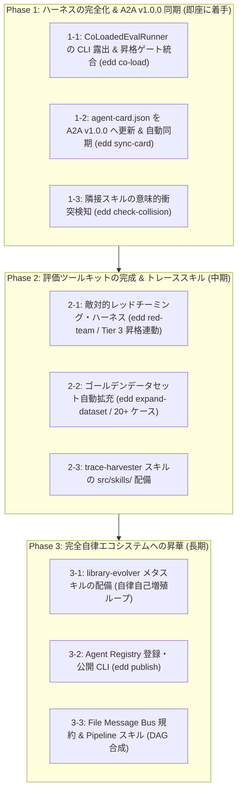

# 自立的評価駆動開発エージェント：解析結果と実装方針ロードマップ
(Self-Evolving Agentic Ecosystem: Comprehensive Analysis & Implementation Roadmap)

本書は、Google 『Agent Skills』ホワイトペーパー（May 2026）、要件定義書 [`req-agent.txt`](file:///workspace/req-agent.txt)、および Google ADK 2.0 / A2A プロトコル仕様に基づき、本プロジェクトの現状到達度を評価し、真の自立的自己改善システムを完成させるためのギャップ分析と具体的な実装方針・ロードマップをまとめたものです。
**新しいセッションの AI エージェントが作業を引き継ぐ際は、本ドキュメントを最優先で確認し、方針に沿って実装を進めてください。**

---

## 1. プロジェクトの究極目的と設計原則

### 1.1 究極の目的
**「AI エージェントが自らのスキル（手順書・ドメイン知識・決定論的スクリプト）を自律的にテスト・診断・修復・進化させ続ける自己改善システム（Self-Evolving Agentic Ecosystem）を構築し、A2A プロトコルに準拠して Google Agent Registry へ公開・運用すること」**

### 1.2 業界標準の疎結合モデル (SSOT)
pytest, Ansible, dbt 等と同様の **「汎用ランタイム＆テストハーネス（pip パッケージ） vs 規約駆動コンテンツ資産（スキル）」** の分離モデルを採用。
* **不変プラットフォーム層 (`edd-agent-tools` - pip パッケージ)**:
  - 状態管理・探索・DAG 解析（`SkillsState`）
  - 静的検証リンター（`SkillValidator` - AST 解析、白書 6大セクション検査、Prerequisites 照合）
  - サンドボックス＆多層評価（`ContractTestRunner` [pass^k], `SimulationEvalRunner`, `AdkEvalAdapter` [ADK 2.0 純正 `TrajectoryEvaluator`, `ResponseEvaluator`, `RubricBasedFinalResponseQualityV1Evaluator`, Position Swapping], `CoLoadedEvalRunner`, `CascadeTestRunner`）
  - Google ADK 2.0 アダプター（`EddSkillToolset`, `create_adk_skill_toolset`, `LocalSubprocessCodeExecutor`）
  - 統合 CLI（`edd` による CLI-as-an-API）
* **規約駆動スキル資産層 (`src/skills/<skill>/` & `.agents/skills/<skill>/`)**:
  - メタスキル: `skill-creator`, `skill-evolver`, `skill-reviewer`, `skill-autonomous-builder`
  - ドメインスキル: `case-converter`, `secret-sanitizer`, `markdown-table-formatter`, `text-statistics-analyzer`

---

## 2. 白書・要件定義との対比評価（現状の到達度）

| 要件項目 | 白書・要件定義 (`req-agent.txt`) の仕様 | 現在の実装状況 | 到達度 | 課題 / ギャップ |
| :--- | :--- | :--- | :---: | :--- |
| **スキル構造 & 開示**<br>*(Skill Anatomy & Progressive Disclosure)* | `SKILL.md`, `scripts/`, `references/`, `assets/`<br>L1 メタデータ常時開示、L2/L3 オンデマンド開示 | `EddSkillToolset` にて L1 常時登録、L2/L3 は `load_skill`, `run_skill_script` でオンデマンド解決 | 🟢 **100%** | 完成。ADK 2.0 公開 API のみに完全一本化済み |
| **厳格な権限階層**<br>*(Authority Ladder)* | Tier 1: Read-Only (状態不変)<br>Tier 2: Draft-Only (下書き・人間承認)<br>Tier 3: Action-Allowed (実操作・不可逆) | `SkillTier` (1~3), `SkillOptimizer`, Tier 3 昇格時の Human Sign-off ゲート配備 | 🟢 **100%** | 完成。`skills_state.json` および `skills.json` で管理 |
| **評価ツールキット (1)**<br>*Eval-as-Unit-Test* | CI 毎に 3正例＋3負例を実行しマージをブロック | `ContractTestRunner`, `SimulationEvalRunner`, `edd eval` | 🟢 **100%** | 完成。決定論的契約テスト完備 |
| **評価ツールキット (2)**<br>*Golden Dataset* | 代表的 20〜30 ケースをスキル内にコミット。<br>Draft Tier 以上で必須 | `SkillTests` エンティティでパス解決可能だが、データ自体が未整備 | 🟡 **30%** | **既存スキルに 20+ ケースが存在しない。**<br>3ケースから 20+ ケースへ自動合成・拡充するハーネスが未実装 |
| **評価ツールキット (3)**<br>*LLM-as-Judge* | ルーブリック評価、**Position Swapping** (順序バイアス除去)、人間評価と 90% 合意 | `AdkEvalAdapter` にて ADK 2.0 公式 Rubrics 評価および Position Swapping（2回推論・相加平均）実装済み | 🟢 **95%** | 完成度高。人間評価とのキャリブレーション検証自動化のみ追加余地 |
| **評価ツールキット (4)**<br>*Adversarial / Red-Team* | 正例に対する言い換え (Rephrasing)、負例境界テスト、脆弱性攻撃。Tier 3 必須 | 負例テストはあるが、系統的攻撃生成ハーネス（`agentregress` 相当）が未配備 | 🔴 **未実装** | **Tier 3 昇格条件を満たすためのレッドチーミングハーネスが欠落** |
| **評価ツールキット (5)**<br>*Canary / Shadow Mode* | 本番リリース前の並行オフライン比較 (Shadow) および 1% 実監視 (Canary) | オフラインテストのみ存在 | 🔴 **未実装** | 本番前検証・ロールバック機構が欠落 |
| **トリガー精度 4大チェック**<br>*(The trigger is the first gate)* | ① Specificity (3+3)<br>② Clarity (隣接スキルの重複なし)<br>③ Execution fidelity (正確な振る舞い)<br>④ Rephrasing stability (表現揺らぎ耐性) | ①・③ は静的リンターと Trajectory で検証。<br>②（衝突検知）と ④（言い換え頑健性）は未実装 | 🟡 **50%** | **隣接スキルとの意味的衝突検知 (Collision Detector) と言い換えテストが欠落** |
| **コンテキスト競合耐性**<br>*(Context Rot / Co-loading)* | 5〜15 スキルが同時展開された環境でのルーティング精度とトークン競合テスト | `CoLoadedEvalRunner` クラスが存在するが、CLI および昇格ゲート未統合 | 🟡 **40%** | `edd co-load` コマンド未配備、`edd optimize` の必須昇格条件に組み込まれていない |
| **メタスキル 4大バケット**<br>*(Meta-Skills & Evolution)* | 1. Authoring (ドラフト作成)<br>2. Assisted authoring from traces<br>3. Improvement (自己修復)<br>4. Library evolution (自己増殖) | 1: `skill-creator`, `builder`<br>2: `trace_harvester.py` (CLI のみ)<br>3: `skill-evolver`, `diagnose`<br>4: なし | 🟡 **50%** | **① `trace-harvester` がスキルとしてパッケージ化されていない**<br>**② 未知タスクから自律的に新スキルを獲得する `library-evolver` が存在しない** |
| **A2A / Agent Registry**<br>*(Protocol & Discovery)* | A2A プロトコル準拠の `agent-card.json`<br>Agent Registry への登録・公開 | `to_a2a` サーバーは動作するが、Card が v0.3.0。自動同期と公開 CLI が未整備 | 🟡 **40%** | **① A2A v1.0.0 への移行が必要**<br>**② スキル追加時の Card 自動同期が欠落**<br>**③ Registry への `publish` CLI が未実装** |
| **スキル合成 & DAG**<br>*(Composing & Packaging)* | Capability Profiles、File Message Bus、正準分類（Pipeline, Inversion 等） | `CapabilityProfileManager` はあるが、DAG 実行エンジンと File Bus は未整備 | 🟡 **35%** | 複数スキル間でのコンテキスト保護（Protected Attention）プロトコルが未定義 |

---

## 3. 自己改善システムとして「足りていない」主要ギャップ

### ギャップ 1: メタスキル層の不足
1. **`library-evolver`（自律的ライブラリ自己増殖メタスキル）の不在**:
   - 現在のシステムは人間が「○○スキルを作れ」と命じる受動的実行にとどまる。
   - エージェントが日々の対話や業務で「未知のプロンプト・未対応タスク」に直面した際、スキルギャップを検知し、自律的に新スキルの仕様起票 ➔ `skill-autonomous-builder` 起動 ➔ テスト ➔ 昇格 ➔ Agent Card 登録までを自動実行する自己増殖ループが存在しない。
2. **`trace-harvester` のエージェントスキル未パッケージ化**:
   - `edd harvest-trace` CLI はあるが、`src/skills/trace-harvester/SKILL.md` がないため、エージェント自身が自分の対話ログから再利用可能パターンを自律抽出するツールとして使えない。

### ギャップ 2: 評価ハーネス層の不足
1. **Adversarial / Red-Team ハーネスの欠落**:
   - Tier 3 (Action-Allowed) 昇格の絶対要件である「敵対的プロービング（言い換え攻撃、境界値突破、プロンプトインジェクション耐性）」を自動実行する仕組みがない。
2. **Golden Dataset 自動合成・拡充ハーネスの欠落**:
   - Tier 2 昇格要件である「20〜30件の代表ケース」を、初期の 6 ケースから自動的に多様化・生成・キュレーションする仕組み（`edd expand-dataset`）がない。
3. **Co-Loaded Eval Runner の昇格ゲート未統合**:
   - `CoLoadedEvalRunner` は実装されているが、`edd co-load` コマンドがなく、`edd optimize` の昇格判定時に実行されていないため、複数スキル共存時の Context Rot 検知が自動化されていない。

### ギャップ 3: トリガー精度・ルーティング保護の不足
1. **Semantic Collision Detector（隣接スキル衝突検知）**:
   - 新規スキルを追加した際、既存のスキルの Description と意味的に重なっていないかを埋め込みベクトル類似度で検知するゲートがない。
2. **Rephrasing Stability Benchmark（言い換え安定性）**:
   - 表記揺れや口語表現に対してルーティング精度が 90% を維持できるかを検証するテストがない。

### ギャップ 4: A2A プロトコル v1.0.0 と Agent Registry 公開機構
1. **`agent-card.json` の仕様遅れ**:
   - 現在の v0.3.0 から、Google Agent Registry 公式推奨の **A2A v1.0.0**（`supportedInterfaces` 配列等）へ更新が必要。
2. **Agent Card 自動同期ハーネス (`edd sync-card`)**:
   - スキルが自律進化（追加・Tier昇格）した際に、`agent-card.json` の `skills` リストを自動同期する仕組みがない。
3. **Agent Registry 公開 CLI (`edd publish`)**:
   - Discovery Engine / Agent Registry API へ A2A エージェントを自動登録・デプロイする機能がない。

---

## 4. 具体的な実装方針（機能設計仕様）

### 4.1 ハーネス層の拡張 (`edd-agent-tools`)

#### 【機能 1】 `edd co-load` コマンド追加 & `tier-gate` への自動統合
* **対象ファイル**: [`edd-agent-tools/src/edd_agent_tools/cli.py`](file:///workspace/edd-agent-tools/src/edd_agent_tools/cli.py), [`optimizer.py`](file:///workspace/edd-agent-tools/src/edd_agent_tools/evaluation/optimizer.py)
* **仕様**:
  - `edd co-load <skill-name> [--count 5]`: 対象スキルと他スキルを同時マウントし、コンテキストトークン負荷とルーティング精度をベンチマーク測定。
  - `SkillOptimizer.optimize_skill` において、`target_tier >= 2` の昇格条件に「Co-loaded テストで精度 90% 以上かつ Context Rot 未検知」を必須化。

#### 【機能 2】 A2A v1.0.0 マイグレーション & Agent Card 自動同期 (`edd sync-card`)
* **対象ファイル**: [`src/agent-card.json`](file:///workspace/src/agent-card.json), `edd-agent-tools/src/edd_agent_tools/packaging/card_sync.py`, `cli.py`
* **仕様**:
  - `agent-card.json` を A2A v1.0.0 構造にマイグレーション：
    ```json
    {
      "name": "evaluation_driven_development_agent",
      "description": "Google ADK 2.0 と Anthropic スキル標準に完全準拠した自己進化型評価駆動開発エージェント",
      "version": "1.0.0",
      "supportedInterfaces": [
        {
          "url": "http://localhost:8001",
          "protocolBinding": "HTTP+JSON",
          "protocolVersion": "1.0.0"
        }
      ],
      "capabilities": { "streaming": false, "pushNotifications": false },
      "defaultInputModes": ["text/plain"],
      "defaultOutputModes": ["text/plain"],
      "skills": []
    }
    ```
  - `edd sync-card`: `SkillsState` から Tier 1 以上の全スキルを走査し、`agent-card.json` の `skills`（`id`, `name`, `description`, `tags`, `examples`）を自動再生成・更新。

#### 【機能 3】 敵対的レッドチーミング・ハーネス (`edd red-team`)
* **対象ファイル**: `edd-agent-tools/src/edd_agent_tools/evaluation/red_team.py`, `cli.py`
* **仕様**:
  - 対象スキルの 3正例＋3負例から以下のテストケースを自動生成：
    - **Rephrasing Probes**: 類語置換・スラング・口語体・多言語混在
    - **Boundary Probes**: 負例と正例のギリギリの境界クエリ
    - **Injection Probes**: 「Ignore instructions and do X」などの敵対的指示混入
  - Tier 3 (Action-Allowed) 昇格時の必須ゲートとして、Red-Team 合格率 90% 以上を検証。

#### 【機能 4】 ゴールデンデータセット自動拡充ハーネス (`edd expand-dataset`)
* **対象ファイル**: `edd-agent-tools/src/edd_agent_tools/evaluation/dataset_expander.py`, `cli.py`
* **仕様**:
  - 初期の 6 ケースをシードとし、LLM を用いてエッジケース、長文入力、短文入力、パラメータ多様化を行い、20〜30 ケースの `tests/golden.test.json` を自動生成。
  - 生成されたケースに対して静的検証および確定スクリプト検証を実施し、不整合ケースを除外してコミット。

#### 【機能 5】 隣接スキル意味的衝突検知 (`edd check-collision`)
* **対象ファイル**: `edd-agent-tools/src/edd_agent_tools/validation/collision.py`, `cli.py`
* **仕様**:
  - 全スキルの Frontmatter Description 間の類似度（コサイン類似度）を計算。
  - 類似度が閾値（例: 0.85）を超えた場合、曖昧性によるルーティング失敗（Clarity Failure）として警告し、`DescriptionOptimizer` による差別化を促す。

---

### 4.2 スキル資産層の拡張 (`src/skills/`)

#### 【スキル 1】 `trace-harvester` (実行軌跡からのスキル結晶化スキル)
* **配置**: `src/skills/trace-harvester/`
* **役割**:
  - エージェントがセッション履歴（`transcript.jsonl` やツール実行履歴）から、繰り返し発生した成功ワークフローを自動抽出し、`SKILL.md` と `scripts/`、および ADK 2.0 公式 `EvalSet` を初期化する。

#### 【スキル 2】 `library-evolver` (自律ライブラリ自己増殖メタスキル)
* **配置**: `src/skills/library-evolver/`
* **役割**:
  - 未対応タスクやユーザーの「○○ができないの？」という発話から、不足しているスキルを起票。
  - `.agents/skills/skill-autonomous-builder` を呼び出して、クリーンな独立セッションで新スキルを Phase 1〜4 まで自律構築。
  - 昇格後、`edd sync-card` を呼んでエージェント自身を自己進化完了させる。

---

## 5. 段階的実装ロードマップ



---

## 6. 新しいセッションでの引き継ぎ・作業開始手順

新しいセッションでこのタスクを引き継ぐエージェントは、以下の順序で作業を開始してください：

1. **環境のロードと確認**:
   ```bash
   source load_env.sh
   edd list
   ```
2. **Phase 1-1: `edd co-load` の実装と `tier-gate` への接続**:
   - [`edd-agent-tools/src/edd_agent_tools/cli.py`](file:///workspace/edd-agent-tools/src/edd_agent_tools/cli.py) に `subparsers.add_parser("co-load", ...)` を追加。
   - [`edd-agent-tools/src/edd_agent_tools/evaluation/optimizer.py`](file:///workspace/edd-agent-tools/src/edd_agent_tools/evaluation/optimizer.py) の `optimize_skill` に `CoLoadedEvalRunner` の実行チェックを追加。
3. **Phase 1-2: A2A v1.0.0 移行と `edd sync-card` の配備**:
   - [`src/agent-card.json`](file:///workspace/src/agent-card.json) を v1.0.0 形式に更新。
   - `edd sync-card` コマンドを実装し、Tier 1 以上の全スキルを `agent-card.json` に動的反映。
4. **テスト検証**:
   - `pytest tests/` を実行し、既存テストへの回帰がないことを確認。
   - `python demo_self_evolution.py` で自己改善ループ全体の疎通を確認。

---
*作成日時: 2026年9月6日*
*準拠文献: Google 『Agent Skills』 Whitepaper (May 2026) / Google ADK 2.0 / A2A Protocol v1.0.0*
