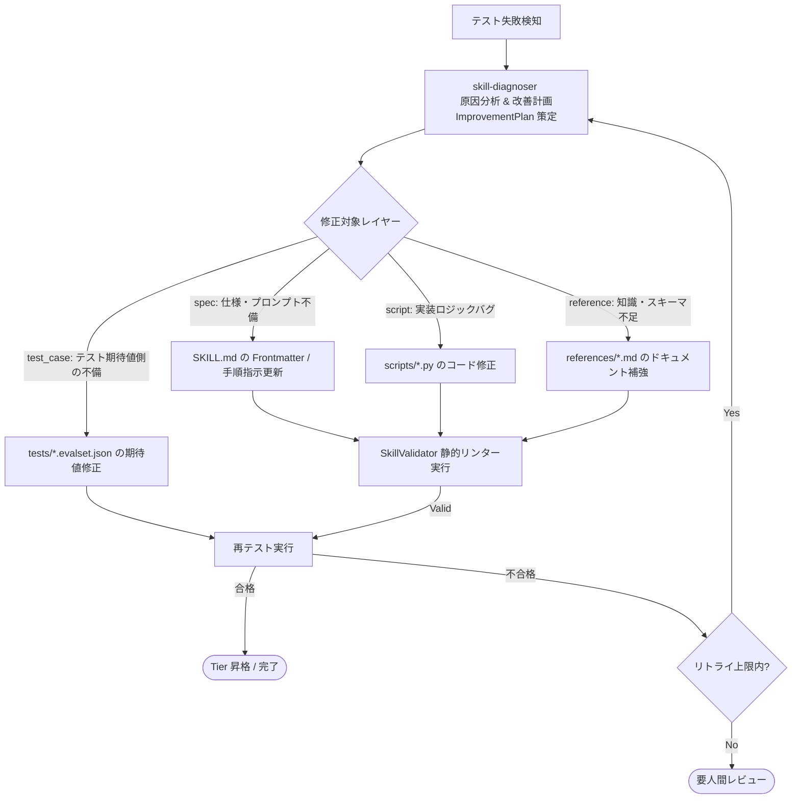

# 自己改善型エージェント（Self-Improving Agent）設計メモ

本メモは、Anthropic 公式スキル体系（Markdown-First & Progressive Disclosure）および Google ADK 2.0 に基づき、自律的に自己改善（Self-Improvement）を繰り返す評価駆動開発（EDD）エージェントを構築するためのアーキテクチャ設計・改善案をまとめたものです。

---

## 1. メタスキルの分類と達成状況

| 分類 | 役割・概要 | 現在の状況 | 対応コンポーネント |
| :--- | :--- | :--- | :--- |
| **1. Authoring (自律生成)** | 要件から `SKILL.md`（単一真実源）と 3層リソース（`scripts/`, `references/`, `assets/`）を自律生成 | **✅ 完了 (実証済み)** | `skill-creator`（4段階品質保証パイプライン） |
| **2. Evaluation Gating (評価防壁)** | Tier階層に応じた多層テストパターン実行と自動昇格 | **✅ 完了 (実証済み)** | `first-test-runner` (Tier 1), `tier2-test-runner` (Tier 2), `tier3-test-runner` (Tier 3), `edd_agent_tools.evaluation` |
| **3. Improvement (自己診断・修復)** | テスト失敗ログやスコアから原因を分析し、3層リソース差分改善計画を策定 | **✅ 完了 (実証済み)** | `skill-diagnoser`（`spec`, `script`, `reference`, `test_case` 差分計画） |
| **4. Evolution (自律最適化ループ)** | テスト ➔ 診断 ➔ 差分修正 ➔ 再テストの完全自動ループ | **✅ 完了 (実証済み)** | `skill-optimizer` 自律改善ループ |

---

## 2. コア設計思想：Markdown-First による自己改善サイクル

自己改善において、「場当たり的な修正」を厳禁とし、**「診断・計画（Diagnosis & Planning）」** と **「3層リソース修正実行（Execution）」** を明確に分離します。



---

## 3. テストログ永続化と診断モデル

`edd_agent_tools.skills.SkillTests` により、テスト実行結果は `tests/results/latest_report.json` に構造化ログとして永続化されます。
`skill-diagnoser` はこのログを読み込み、以下の `ImprovementPlan` を生成します。

```python
class TargetLayer(StrEnum):
    SPEC = "spec"              # SKILL.md の修正（トリガー説明文、意思決定ツリー、手順）
    SCRIPT = "script"          # scripts/*.py の実装ロジック修正
    REFERENCE = "reference"    # references/*.md のドキュメント修正
    ASSET = "asset"            # assets/ のテンプレート修正
    TEST_CASE = "test_case"    # tests/*.evalset.json の不備・期待値修正
```
