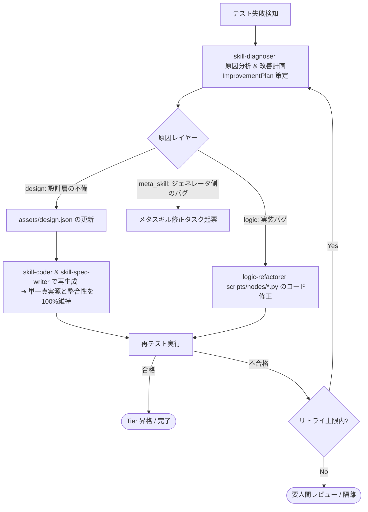

# 自己改善型エージェント（Self-Improving Agent）設計メモ

本メモは、`Agent Skills_Day_3.pdf`（Section 6: On Meta-Skills and Self-Improving Skills）および `req-agent.txt` に基づき、自律的に自己改善（Self-Improvement）を繰り返す評価駆動開発（EDD）エージェントを構築するためのアーキテクチャ設計・改善案をまとめたものです。

---

## 1. メタスキルの分類と現状の達成状況

| 分類 (PDF Section 6) | 役割・概要 | 現在の状況 | 対応コンポーネント |
| :--- | :--- | :--- | :--- |
| **1. Authoring (自動作成)** | 要件から仕様（`design.json`, `SKILL.md`）とコードを自動生成 | **✅ 完了 (実証済み)** | `skill-developer` ワークフロー (`developer-router`, `skill-designer`, `workflow-designer`, `skill-coder`, `skill-spec-writer`) |
| **2. Evaluation Gating (評価防壁)** | Tier階層に応じた5つのテストパターン実行と自動昇格 | **✅ 完了 (実証済み)** | `first-test-runner` (Tier 1), `tier2-test-runner` (Tier 2), `tier3-test-runner` (Tier 3), `edd_agent_tools.evaluation` |
| **3. Improvement (自己改善・修復)** | テスト失敗ログやスコアから原因を分析し、プロンプト/コードを修正 | **⏳ 本設計の対象** | `skill-diagnoser`, `logic-refactorer`, `skill-optimizer` ワークフロー |
| **4. Evolution (トレース抽出・進化)** | 実行ログからのスキル抽出、ライブラリ全体の自律管理 | **⏳ 次フェーズ** | `trace-harvester`, `agent.py` への統合自律ループ |

---

## 2. コア設計思想：診断・計画と修正実行の明確な分離

テスト失敗時の自己改善において、「`SKILL.md` やコードを直接手動編集する場当たり的修正」を厳禁とし、**「診断・計画（Diagnosis & Planning）」** と **「修正・再生成実行（Execution / Regeneration）」** を分離します。



### 分離が必要な理由
1. **単一真実源（`design.json`）の保護**:
   `SKILL.md` や `models.py` は `design.json` から決定論的に生成される成果物です。直接編集による不整合（Context Rot）を防ぐため、設計起因の改善は必ず `design.json` を更新してジェネレータで一括再生成します。
2. **多層診断（マルチレイヤー分析）**:
   エラーの原因が「トリガー説明の曖昧さ」「パラメータの型不一致」「ノード実装の例外」「テストケース自体の不備」「メタスキル側のテンプレートバグ」のどこにあるかを特定した上で、適切なレイヤーに対して修正を発行します。

---

## 3. テストディレクトリ構造と実行ログの永続化

テストの「入力仕様（資産）」と「実行結果ログ（成果物）」を明確に分離するため、各スキル内の `tests/` 配下に **`results/`** サブディレクトリを設けます。

### ディレクトリ構成
```
src/skills/<skill-name>/
├── SKILL.md
├── assets/
│   └── design.json
├── scripts/
│   ├── handler.py
│   ├── models.py
│   └── nodes/
└── tests/
    ├── <skill>_trigger.evalset.json   # 👈 [入力] トリガーテスト定義
    ├── <skill>_unit.evalset.json      # 👈 [入力] 契約単体テスト定義
    ├── fixtures/                      # 👈 [入力] モック用静的データ
    └── results/                       # 👈 [出力] テスト実行結果ログ
        ├── latest_report.json         # 最新テスト実行の統合詳細レポート
        ├── contract_test_result.json  # 契約テスト詳細ログ
        └── trigger_test_result.json   # トリガーテスト詳細ログ
```

### 詳細テストレポートスキーマ（`EvalDetailReport`）
```json
{
  "skill_name": "sample-skill",
  "test_type": "contract",
  "timestamp": "2026-08-29T02:30:00Z",
  "summary": {
    "total": 5,
    "passed": 3,
    "failed": 2,
    "accuracy": 0.6
  },
  "failed_cases": [
    {
      "eval_case_id": "case_invalid_input",
      "function_name": "execute_task",
      "inputs": {"text": ""},
      "expected": "success",
      "error_type": "ValidationError",
      "error_message": "1 validation error: field required",
      "traceback": "Traceback (most recent call last):\n  ..."
    }
  ]
}
```

---

## 4. `edd-agent-tools` パッケージへのクラス拡張設計

`Skill` クラスが `assets/` や `scripts/` を抽象化しているのと同様に、テスト構造も **`SkillTests`** クラスとしてカプセル化します。

```python
class SkillTests:
    """スキルの tests/ ディレクトリ配下のテスト仕様および実行ログを管理するクラス。"""
    
    def __init__(self, skill_root_dir: str):
        self.skill_root_dir = skill_root_dir
        self.tests_dir = os.path.join(skill_root_dir, "tests")
        self.results_dir = os.path.join(self.tests_dir, "results")
        self.fixtures_dir = os.path.join(self.tests_dir, "fixtures")

    @property
    def latest_report_path(self) -> str:
        return os.path.join(self.results_dir, "latest_report.json")

    def get_evalset_path(self, test_type: str) -> str:
        """指定されたテスト種別の evalset パスを安全に解決"""
        ...

    def save_report(self, report: EvalDetailReport, test_type: str) -> str:
        """テスト結果レポートを results/ 配下に保存し latest_report.json を更新"""
        ...

    def load_latest_report(self) -> Optional[EvalDetailReport]:
        """最新のテスト実行レポートをロード"""
        ...
```

### `Skill` クラスへの統合
```python
class Skill:
    ...
    @property
    def tests(self) -> SkillTests:
        """テストおよび実行ログ管理インターフェースを取得"""
        return SkillTests(self.root_dir)
```

---

## 5. 今後の実装ロードマップ

1. **フェーズ 1: テストログ永続化基盤の整備**
   - `edd-agent-tools` に `SkillTests` クラスおよび `EvalDetailReport` モデルを追加。
   - `ContractTestRunner` や各テスト実行器（`test-executor` 等）で失敗時に `tests/results/` へ構造化ログを出力するよう改修。
2. **フェーズ 2: 診断メタスキル（`skill-diagnoser`）の開発**
   - `tests/results/latest_report.json` を読み込み、根本原因分析と `ImprovementPlan` を生成するスキルを開発。
3. **フェーズ 3: 修正実行スキル（`logic-refactorer`）の開発**
   - ロジック層起因の失敗に対し、`nodes/` 配下のカスタム実装を安全に修正するスキルを開発。
4. **フェーズ 4: 自己改善ワークフロー（`skill-optimizer`）の構築と統合**
   - 「テスト実行 ➔ 診断 ➔ 再生成/コード修正 ➔ 再テスト」の自律ループワークフローを構築し、テスト失敗スキルの自律修復を実証。
