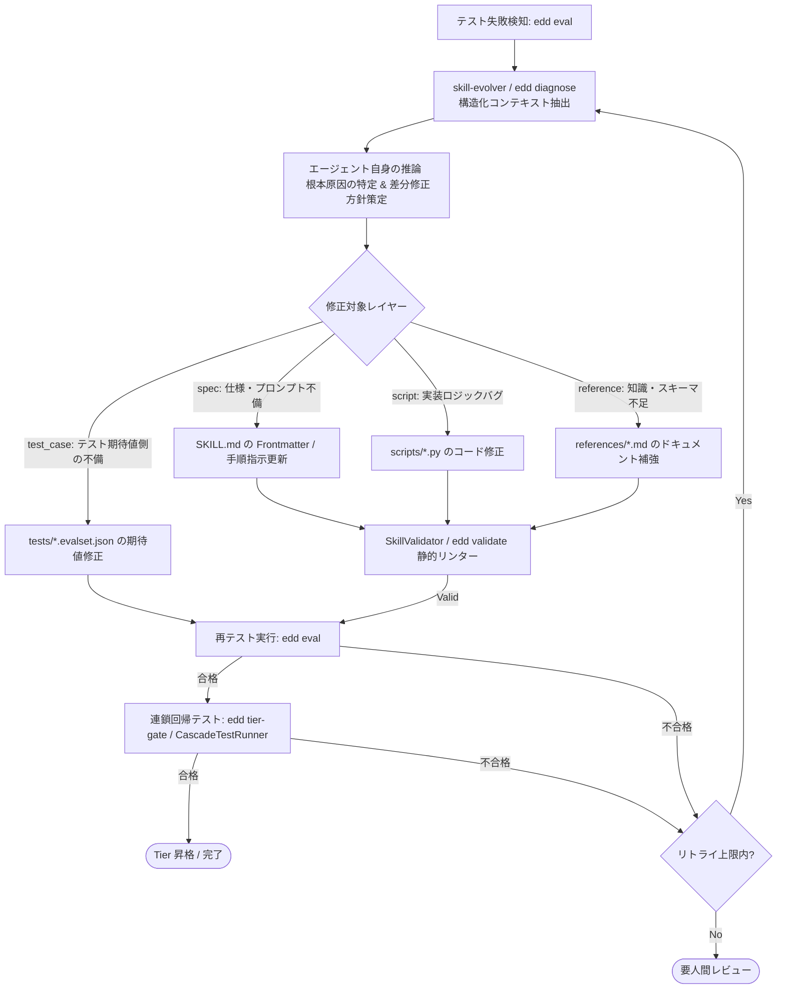

# 自己改善型エージェント（Self-Improving Agent）設計メモ

本メモは、Anthropic 公式スキル体系（Markdown-First & Progressive Disclosure）および Google ADK 2.0 に基づき、自律的に自己改善（Self-Improvement）を繰り返す評価駆動開発（EDD）エージェントを構築するためのアーキテクチャ設計・責務分離ガイドです。

---

## 1. プラットフォーム基盤 vs スキル資産の責務境界 (SSOT & Separation of Concerns)

```mermaid
flowchart TD
    subgraph PlatformLayer ["不変プラットフォーム層 (pip: edd-agent-tools)"]
        Validator["SkillValidator (AST/構文静的リンター)"]
        Runners["ContractTestRunner & SimulationEvalRunner (サンドボックス実行)"]
        StateEngine["SkillsState & DAG Validator (状態・Tier 1~3 管理)"]
        Packager["SkillPackager (安全な ZIP アーカイブ生成)"]
        ADKAdapter["ADK Adapter (create_adk_skill_toolset)"]
        UnifiedCLI["統合 CLI edd (動的ディスパッチ)"]
    end

    subgraph SkillAssets ["自己改善スキル資産層 (src/skills/)"]
        Creator["skill-creator: スキル設計・Markdownテンプレート・雛形生成"]
        Evolver["skill-evolver: 失敗診断・自己修復ループ・Tier昇格"]
        DomainSkills["case-converter 等の実用ドメインスキル"]
    end

    PlatformLayer -->|基盤SDK・テストハーネス提供| SkillAssets
    SkillAssets -->|自己改善ループ (Markdown/Scripts/Assets修正)| SkillAssets
```

### 原則
1. **プラットフォーム不変性**: `edd-agent-tools` パッケージはスキーマ検証、テスト実行、状態管理、ZIPパッケージャなどの決定論的インフラに徹し、プロンプト文体や生成ロジックをコード内に過度にハードコードしない。
2. **自己改善の局所性と安全性**: スキルのプロンプト文体、パターン構造（workflow, task_based, reference, capabilities）、手順指示はスキルディレクトリ内の `SKILL.md` や `scripts/` に集約し、エージェントが自己改善（プロンプト進化）する際に pip パッケージのコードを変更する必要をなくす。

---

## 2. メタスキルの分類と達成状況

| 分類 | 役割・概要 | 現在の状況 | 対応コンポーネント |
| :--- | :--- | :--- | :--- |
| **1. Authoring (自律生成)** | 要件から `SKILL.md`（単一真実源）と 3層リソース（`scripts/`, `references/`, `assets/`, `tests/`）を自律生成・パッケージング | **✅ 完了 (実証済み)** | `skill-creator`（4大パターンテンプレート + 契約テスト完備） |
| **2. Evolution (評価・自己改善・昇格)** | 多層評価テスト実行 ➔ 失敗診断 ➔ 差分修正 ➔ 上位連鎖回帰テスト ➔ Tier 昇格の完全改善ループ | **✅ 完了 (実証済み)** | `skill-evolver`（統合 eval / diagnose / optimize） |

---

## 3. コア設計思想：Markdown-First による自己改善サイクル

自己改善において、「場当たり的な修正」を厳禁とし、**「決定論的診断・コンテキスト抽出（Diagnosis & Context Extraction）」** と **「エージェントによる推論・3層リソース修正実行（Reasoning & Patching）」** を明確に分離します。



---

## 4. テストログ永続化と診断モデル

テスト実行結果は `tests/results/latest_report.json` に構造化ログとして永続化されます。
`SkillDiagnoser`（および `edd diagnose`）はこのログを読み込み、以下の対象レイヤーに分類してエージェントに提示します。

- **`spec`**: `SKILL.md` の修正（トリガー説明文、意思決定ツリー、手順）
- **`script`**: `scripts/*.py` の実装ロジック修正
- **`reference`**: `references/*.md` のドキュメント・スキーマ修正
- **`asset`**: `assets/` のテンプレート修正
- **`test_case`**: `tests/*.evalset.json` の不備・期待値修正
