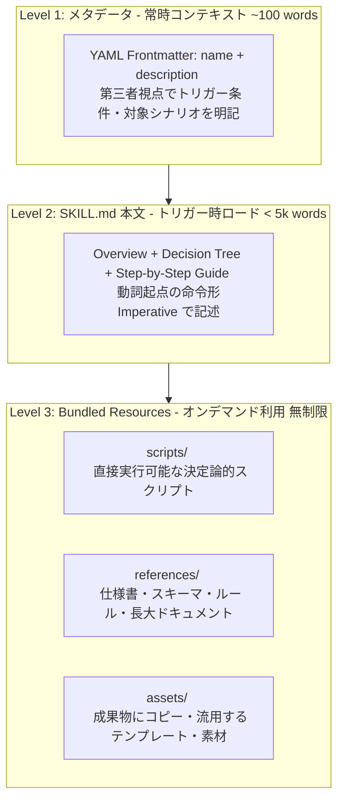
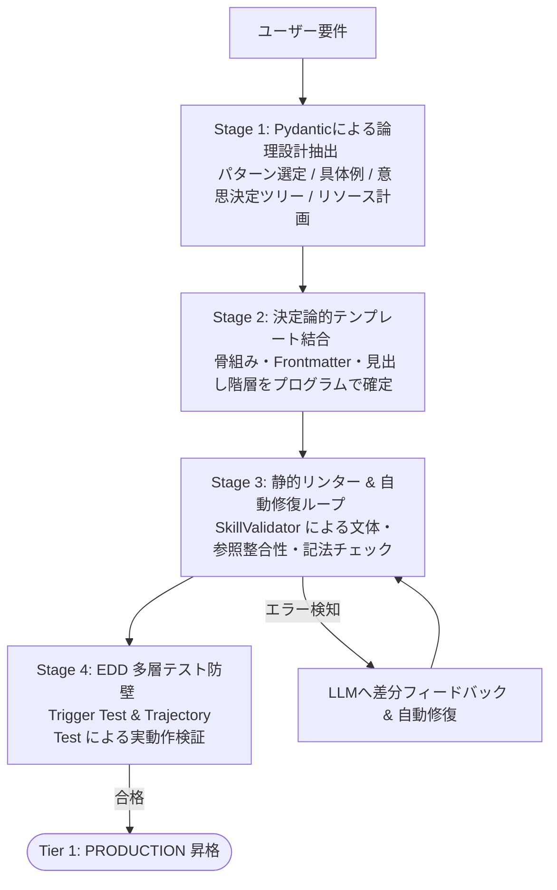
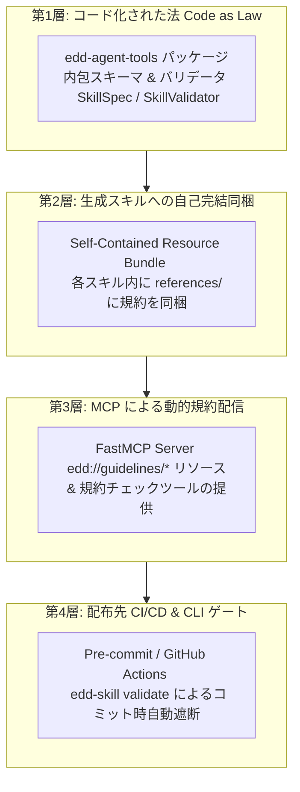
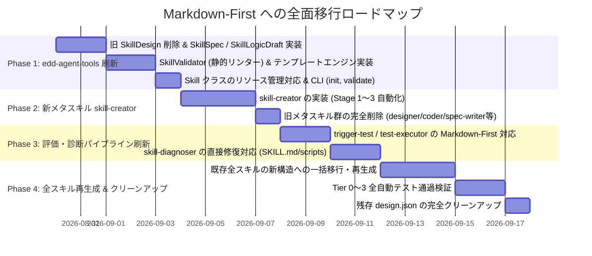

# スキルアーキテクチャ・モダナイゼーション方針書 (決定版)
**〜 `design.json` の完全撤廃と、4段階品質保証パイプラインによる Markdown-First / Progressive Disclosure への全面刷新計画 〜**

---

## 1. エグゼクティブ・サマリー & パラダイムシフト

### 💡 `design.json` の完全撤廃と根本的パラダイムシフト
本プロジェクトは、初期に採用した「Pydanticによる単一真実源（`design.json`）」を完全に廃止し、Anthropic公式スキル体系（`awesome-claude-skills-master`）が実証した **「Markdown-First（`SKILL.md` 単一真実源）+ Progressive Disclosure（3層リソース分離）」** へ全面移行します。

後方互換性の維持を目的とした不自然なコード、中間変換層、モンキーパッチは一切残さず、**ベストプラクティスを最優先した大規模リファクタリング**を実施します。

```mermaid
flowchart TD
    subgraph Old_Paradigm [旧パラダイム: RPC / マイクロサービス思想 (完全廃止)]
        Old_SSOT[design.json <br/> 複雑なPydantic JSON] --> Old_M[models.py]
        Old_SSOT --> Old_H[handler.py]
        Old_SSOT --> Old_E[executor.py]
        Old_SSOT --> Old_N[nodes/*.py]
        Old_SSOT --> Old_S[SKILL.md <br/> 単なる機械的引数テーブル]
        style Old_Paradigm fill:#ffebee,stroke:#c62828
    end

    subgraph New_Paradigm [新パラダイム: 認知的ガイドライン & 3層リソース (新標準)]
        New_SSOT[SKILL.md <br/> Frontmatter + 意思決定ツリー + 手続き] --> R1[scripts/ 実行スクリプト]
        New_SSOT --> R2[references/ 参照仕様・ドメイン知識]
        New_SSOT --> R3[assets/ 出力用テンプレート・素材]
        style New_Paradigm fill:#e8f5e9,stroke:#2e7d32
    end
```

### 🎯 解決される根本課題
1. **ボイラープレート地獄の根絶**: 
   1スキルあたり6〜8ファイル存在した多層ラッパー（`models.py`, `handler.py`, `executor.py`, `nodes/` 等）を全廃し、平均80%のファイル数を削減。
2. **スキルの表現力の解放**: 
   ドキュメント参照型、ガイドライン提供型、テンプレート配布型、スクリプト実行型など、あらゆる形態のスキルを自然に表現可能にする。
3. **推論リソースの最適化**: 
   中間JSONの相互変換やボイラープレートの修復に消費されていたトークンを全廃し、スキルの本質的なロジック・手順の洗練に集中。

---

## 2. 新アーキテクチャ仕様：Markdown-First & Progressive Disclosure



### ① Progressive Disclosure（3段階の情報開示）
* **Level 1: メタデータ（YAML Frontmatter）**:
  - `name`: ハイフンケースの識別子（例: `pdf-editor`, `changelog-generator`）。
  - `description`: 第三者視点（"This skill should be used when..."）で、トリガー条件、対象ファイル、対応タスクを簡潔に定義（100 words以内）。
* **Level 2: `SKILL.md` 本文**:
  - スキルがトリガーされた時にロード。
  - 概要、ワークフロー決定木（Workflow Decision Tree）、具体的なステップ別手順、エラー対処方針を記述。
* **Level 3: バンドルリソース（Bundled Resources）**:
  - `scripts/`: Python/Bash等の実行スクリプト（LLMがコンテキストに読まずに直接実行可能）。
  - `references/`: APIドキュメント、データベーススキーマ、業務ガイドライン（必要時のみLLMが読む）。
  - `assets/`: 出力用テンプレート、HTML/Reactボイラープレート、デザイン素材（LLMが成果物にコピーする）。

### ② 4大スキルパターン（Skill Patterns）
すべてのスキルを以下の4パターンのいずれかに分類し、最適な構成を取らせます。

| パターン | 主な用途 | 推奨リソース構成 | SKILL.md 構造 |
| :--- | :--- | :--- | :--- |
| **1. Workflow-Based** | 段階的な手順や判断分岐がある作業 | `scripts/`, `references/` | Overview → Decision Tree → Step 1 → Step 2 |
| **2. Task-Based** | 複数の独立したツール・操作群の提供 | `scripts/` 中心 | Overview → Quick Start → Task 1 → Task 2 |
| **3. Reference/Guidelines** | 規約・設計標準・ドメイン知識の提供 | `references/` 中心 | Overview → Guidelines → Specifications → Best Practices |
| **4. Capabilities-Based** | 複合的なシステム連携・包括的機能 | `scripts/`, `references/`, `assets/` | Overview → Core Capabilities → Capability List |

### ③ ディレクトリ標準構造
```
src/skills/<skill-name>/
├── SKILL.md                 # 👈 【必須・単一真実源】
├── scripts/                 # 👈 [任意] 実行可能スクリプト（ラッパーなしの直接実装）
│   ├── helper.py
│   └── run_task.sh
├── references/              # 👈 [任意] オンデマンド参照ドキュメント
│   ├── api_schema.md
│   └── workflow_guide.md
├── assets/                  # 👈 [任意] 出力用テンプレート・素材
│   └── template.html
└── tests/                   # 👈 [必須] EDD テスト仕様および結果ログ
    ├── trigger.evalset.json
    ├── unit.evalset.json
    └── results/
        └── latest_report.json
```

---

## 3. `SKILL.md` 自動生成の「4段階品質保証パイプライン」

「LLMの自由記述によるブレ・品質低下」を完全に排除し、Anthropic水準の極めて洗練された `SKILL.md` を安定・決定論的に生成するため、**4段階の品質保証パイプライン（Stage-Gate Quality Pipeline）** を新設します。



### Stage 1: 【思考の構造化】Pydantic による論理設計の抽出
LLMにいきなりMarkdown本文を書かせず、まず **設計の骨子のみを構造化データ（Pydanticモデル）として出力** させます。

```python
class DecisionBranch(BaseModel):
    condition: str = Field(..., description="分岐条件 (例: 入力ファイルがPDF形式の場合)")
    action: str = Field(..., description="実行するアクションまたは参照先 (例: scripts/rotate_pdf.py を実行)")

class StepInstruction(BaseModel):
    step_number: int
    title: str = Field(..., description="ステップの見出し (動詞起点)")
    action_imperative: str = Field(..., description="具体的な手順指示 (To do X, execute Y 形式)")
    target_resource: str | None = Field(None, description="使用するスクリプトまたは参照資料の相対パス")

class ResourcePlan(BaseModel):
    rel_path: str = Field(..., description="ファイル相対パス (例: scripts/convert.py, references/schema.md)")
    type: Literal["script", "reference", "asset"]
    purpose: str = Field(..., description="このリソースが果たす役割")

class SkillLogicDraft(BaseModel):
    """LLMが要件から抽出する論理設計データ"""
    name: str = Field(..., pattern=r"^[a-z0-9-]+$", description="ハイフンケースのスキル名")
    pattern: SkillPattern = Field(..., description="4パターンのいずれか")
    description_third_person: str = Field(..., max_length=300, description="第三者視点でのトリガー説明")
    concrete_trigger_examples: list[str] = Field(..., min_length=3, max_length=5, description="具体的なユーザー発話例")
    overview_summary: str = Field(..., description="スキルの目的・提供価値 (1〜2文)")
    decision_tree: list[DecisionBranch] = Field(default_factory=list, description="条件分岐ルール")
    execution_steps: list[StepInstruction] = Field(..., min_length=1, description="動詞起点の実行手順リスト")
    resources_plan: list[ResourcePlan] = Field(default_factory=list, description="3層リソースの計画一覧")
```

### Stage 2: 【決定論的組み立て】公式準拠テンプレートエンジンによる結合
Stage 1 で抽出された論理設計を、`edd-agent-tools` の **決定論的テンプレートエンジン** に流し込み、`SKILL.md` を組み立てます。

* **保証される品質**:
  - YAML Frontmatterの構文・フィールドの完全性。
  - `# Title`, `## Overview`, `## Workflow Decision Tree`, `## Resources` 等の標準見出し階層。
  - 見出しの抜け落ちやレイアウトの乱れは **プログラムによって100%排除** されます。

### Stage 3: 【静的検証 & 自動修復】`SkillValidator` による静的リンター
生成された `SKILL.md` とリソース群に対し、システムが自動で厳格な静的テスト（Linting）を実行します。

| チェックカテゴリ | 検証項目 | 違反時の処理 |
| :--- | :--- | :--- |
| **Frontmatter 構文** | `name` が正規表現 `^[a-z0-9-]+$` か、`description` が存在し100 words以内か、`< >` のエスケープ漏れがないか | 自動サニタイズまたは再生成 |
| **トリガー品質** | `description` が第三者視点（"This skill should be used when..." 等）で書かれているか | プロンプトで書き直し指示 |
| **リソース参照整合性** | `SKILL.md` 内で言及された `scripts/*.py` や `references/*.md` がファイルシステム上に実在するか | 存在しないファイルへの言及を検知・修正 |
| **文体・トーン (Imperative)** | 日本語の「〜してください」「〜が必要です」や英語の「You should」を検知 | 動詞起点（「〜する」「To do X, execute Y」）へ自動正規化 |

* **自己修復ループ**:
  エラーが検出された場合、エラー箇所（行番号と理由）を `skill-creator` にフィードバックし、最大3回まで自動修正（Self-Correction）させます。

### Stage 4: 【振る舞い検証】EDD（評価駆動開発）多層テストによる実動作保証
静的チェックに合格した後、当プロジェクトのコア強みである **EDDテストハーネス** が動的に `SKILL.md` の有効性を検証します。

1. **Trigger Test（業界基準90%以上のトリガー精度）**:
   - `SKILL.md` のトリガー条件と具体例から、正例（トリガーされるべきプロンプト）と負例（似ているが無関係なプロンプト）を生成。
   - LLMシミュレータに判定させ、意図通りに起動するか測定。
2. **Trajectory / Execution Test（実行シミュレーション）**:
   - 生成された `SKILL.md` を読み込ませた模擬エージェントを動かし、記載された手順通りに `scripts/` や `references/` を活用して課題を解決できるかをテスト。
3. **Tier 1 昇格**:
   - すべてのテストに合格して初めて、そのスキルは本番マウント（`skills_state.json` の Tier 1）されます。

---

## 4. メタスキル群の統廃合：新 `skill-creator` への一元化

旧来の「5段階の分断されたスキル生成パイプライン」を廃止し、Anthropicの `skill-creator` を進化させた **単一の統合メタスキル `skill-creator`** に一元化します。

```mermaid
flowchart LR
    subgraph Old_Workflow [旧ワークフロー: 5ステップ (完全廃止)]
        W1[skill-designer] --> W2[skill-coder]
        W2 --> W3[skill-spec-writer]
        W3 --> W4[import-validator]
        W4 --> W5[design-validator]
        style Old_Workflow fill:#ffebee,stroke:#c62828
    end

    subgraph New_Workflow [新ワークフロー: skill-creator による一元生成]
        N1[ユーザー要件] --> N2[skill-creator <br/> 1. Concrete Examples 抽出 <br/> 2. 3層リソース分解 <br/> 3. SKILL.md & リソース直接生成]
        N2 --> N3[quick_validate <br/> 静的バリデーション]
        N3 --> N4[first-test-runner <br/> 多層テスト & Tier 1 昇格]
        style New_Workflow fill:#e8f5e9,stroke:#2e7d32
    end
```

### 統廃合テーブル
| 旧コンポーネント | 新コンポーネント | 統合・移行理由 |
| :--- | :--- | :--- |
| `skill-designer` | **`skill-creator`** | `design.json` の生成を廃止し、`SKILL.md` の論理設計（Stage 1）へ統合。 |
| `skill-coder` | **`skill-creator`** | 多層ラッパーの生成を廃止し、`scripts/` 内の単体スクリプト生成へ統合。 |
| `skill-spec-writer` | **`skill-creator`** | `design.json` からの逆変換を廃止し、Stage 2 テンプレート結合へ統合。 |
| `workflow-designer` | **`skill-creator`** | ワークフローも `Workflow-Based` パターンのスキルとして一元生成。 |
| `import-validator` | **`SkillValidator`** | `edd-agent-tools` パッケージ内包の静的リンターへ統合。 |
| `design-validator` | **`SkillValidator`** | `edd-agent-tools` パッケージ内包の静的リンターへ統合。 |

---

## 5. `edd-agent-tools` パッケージの全面刷新仕様

### ① データモデルの刷新 (`edd_agent_tools.skills.models`)
* **削除**: `SkillDesign`, `StructuredJsonSkillDesign`, `ValueOnlySkillDesign`, `WorkflowDesign`, `Parameter`, `Step` 等の `design.json` 用クラスを完全削除。
* **新設**: `SkillSpec` モデルおよび `SkillLogicDraft` モデル。
  ```python
  class SkillSpec(BaseModel):
      """SKILL.md の Frontmatter および構造を表現するモデル"""
      name: str = Field(..., pattern=r"^[a-z0-9-]+$")
      description: str = Field(..., max_length=500)
      pattern: SkillPattern = Field(SkillPattern.WORKFLOW)
      license: str | None = None
      
      # Markdown Body から抽出される構造情報
      overview: str = ""
      decision_tree: list[DecisionBranch] = []
      workflow_steps: list[StepInstruction] = []
      scripts: list[str] = []
      references: list[str] = []
      assets: list[str] = []
  ```

### ② `Skill` ドメインクラスの刷新 (`edd_agent_tools.skills.skill`)
* `SKILL.md` を直接ロード・パースする `skill.spec` プロパティを提供。
* `skill.scripts_dir`, `skill.references_dir`, `skill.assets_dir` を直接提供。
* Pythonスクリプトから直接 ADK `FunctionTool` を生成する軽量機構（多層ラッパーのロード処理を全廃）。

### ③ 静的バリデータ・CLIの組み込み (`edd_agent_tools.skills.validator`, `cli`)
* `edd-skill validate <skill_dir>`: Frontmatter、命名規則、リソース参照整合性の静的チェック。
* `edd-skill init <skill_name> --pattern <pattern>`: Anthropic準拠の雛形ディレクトリの即時生成。
* `edd-skill package <skill_dir>`: 配布用 ZIP パッケージの生成。

---

## 6. 配布・共有先でのルール維持（4層ハーネス防御モデル）



1. **第1層（Code as Law）**: `edd-agent-tools` パッケージ自体に `SkillValidator` と `SkillSpec` を内蔵し、不正なスキルの読み込み・ビルドをシステムレベルで遮断。
2. **第2層（Self-Contained）**: スキル単体を git submodule や ZIP で移動しても、`references/` に規約が内包されているため自律性を維持。
3. **第3層（MCP動的配信）**: FastMCP サーバー経由で外部エージェント（Claude Code, Cursor, Antigravity等）へ規約ドキュメントと検証ツールを提供。
4. **第4層（CI/CDゲート）**: `edd-skill validate` を CI や pre-commit に組み込み、規約違反をリポジトリレベルで遮断。

---

## 7. プロジェクトルール（`.agents/AGENTS.md`）の全面改定案

[AGENTS.md](file:///workspace/.agents/AGENTS.md) を以下の新標準ルールに全面更新します。

```markdown
# プロジェクト開発ルール (Markdown-First & Progressive Disclosure 標準)

## 1. 開発パッケージの利用 (`edd-agent-tools`)
* プロジェクトで開発中のパッケージ (`edd-agent-tools`) を優先して活用し、そのコーディング規約に従ってください。
* スキルのロード、静的バリデーション、テスト実行、Geminiクライアント生成等の共通ロジックは `edd-agent-tools` に集約してください。

## 2. スキル構造と Progressive Disclosure 規約
* **単一真実源の原則**: スキルの仕様定義はすべて `SKILL.md`（YAML Frontmatter + Markdown）に一元化してください。`design.json` 等の中間設定ファイルは作成しないでください。
* **3層リソース分離**:
  - `scripts/`: 決定論的スクリプト（直接実行可能）
  - `references/`: ドメイン知識・API仕様・スキーマ（LLMがオンデマンドで読む資料）
  - `assets/`: 成果物にコピー・流用するためのテンプレート・ボイラープレート
  すべてのロジックを無理にPythonコードに詰め込まず、ドキュメント参照やテンプレート配布を積極的に活用してください。
* **ボイラープレートの排除**: `models.py`, `handler.py`, `executor.py`, `nodes/` などの冗長な多層ラッパー構造を作成せず、フラットで簡潔な実装を行ってください。

## 3. プロンプトおよび仕様書の記述スタイル規約
* **Imperative Form（動詞起点・客観的指示）**:
  SKILL.mdおよび指示プロンプトはすべて客観的な指示（"To accomplish X, do Y" 形式）で記述し、会話調や曖昧な助動詞（「〜してください」等）を排除してください。
* **Frontmatter の description**:
  第三者視点（"This skill should be used when..."）で、トリガー条件・対象ファイル・対応タスクを100 words以内で極めて具体的に記述してください。

## 4. 場当たり的修正の厳禁とレガシー排除
* **後方互換性よりベストプラクティス優先**: 古いコード（旧 `SkillDesign`, `design.json` 依存ロジック）との後方互換性を保つための不自然なコードやモンキーパッチを残さず、ベストプラクティスに合わせて一括リファクタリングしてください。
* **不要ファイルの即時削除**: 不要になった旧ファイルや旧メタスキルは速やかに削除し、コードベース内のノイズを排除してください。
```

---

## 8. 大規模リファクタリング実施ロードマップ (Phased Execution Plan)



### Phase 1: `edd-agent-tools` の基盤刷新（最優先）
1. `edd_agent_tools.skills.models` から旧 `SkillDesign` 系を削除し、`SkillSpec` および `SkillLogicDraft` を実装。
2. `edd_agent_tools.skills.validator`（静的チェッカー）および Jinja2 テンプレートエンジンを実装。
3. `edd_agent_tools.skills.skill.Skill` を改修し、`SKILL.md` を起点として `scripts/`, `references/`, `assets/` を直接管理できるようにする。
4. `edd_agent_tools.mcp.server` に新ガイドラインリソースと検証ツールを配備。

### Phase 2: 新メタスキル `skill-creator` の実装と旧メタスキルの削除
1. 4段階パイプライン（Stage 1〜3）を実行する統合メタスキル `skill-creator` を実装。
2. 不要となった旧メタスキル（`skill-designer`, `skill-coder`, `skill-spec-writer`, `workflow-designer`, `import-validator`, `design-validator`）を完全に削除。

### Phase 3: 評価・テスト系の Markdown-First 化
1. `trigger-test-generator` および `test-executor` を改修し、`SKILL.md` と `scripts/*.py` を直接対象としてテストを生成・実行できるようにする。
2. `skill-diagnoser` を改修し、エラー発生時に `SKILL.md` や `scripts/` を直接修復（または `skill-creator` で再生成）できるようにする。

### Phase 4: 既存スキルの移行と Tier 昇格検証
1. `src/skills/` 配下の全スキルを新構造（`SKILL.md` + 3層リソース）へ再生成・移行。
2. 全スキルに対して `first-test-runner` 等の多層テストを実行し、すべて正常に Tier 1（Production）へ昇格することを確認。
3. 残存するすべての `design.json` および不要ファイルを完全削除。

---

## 9. 結論

本方針書に基づきリファクタリングを実行することで、**「Anthropicが確立した世界標準の洗練されたスキル体験（Progressive Disclosure・意思決定ツリー・Imperative文体）」** と **「Google ADK / 当プロジェクトが誇る厳格なEDDとTier防壁」** が真の意味で美しく融合します。

エージェント開発における最大のボトルネックであった「過剰なボイラープレート」と「認知的制約」が完全に解消され、世界最高水準の自己進化型エージェントアーキテクチャが完成します。
