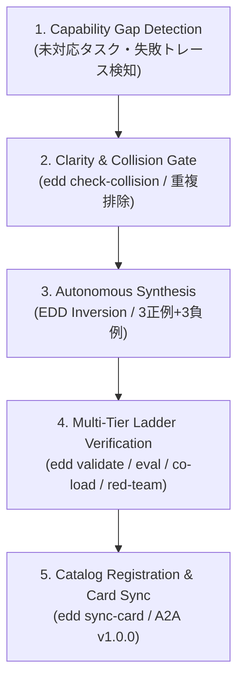

# Library Evolution Lifecycle Reference (Whitepaper Section 6: Voyager Pattern)

## 1. Overview
Library Evolution（自己増殖ライブラリ進化パターン）は、エージェントが未知の課題やツール実行失敗、あるいはユーザーからの新機能要求に直面した際に、人手を介さず自律的に新しいスキルを起票・開発・評価・昇格し、自身のエージェントカードを更新する自律ライフサイクルです。

## 2. 5-Stage Evolution Pipeline

### Stage 1: Capability Gap Detection
- ユーザーの未知の要求（「○○を自動化して」）やツールの未対応例外を検知。
- タスク要件から適切な `kebab-case` のスキル名と入出力仕様を策定。

### Stage 2: Clarity & Collision Gate
- `edd check-collision` を実行し、既存スキルとの意味的重複（Cosine Similarity > 0.60）を検査。
- 重複がある場合は新規作成ではなく既存スキルの進化（`skill-evolver`）へ分岐。

### Stage 3: Autonomous Synthesis
- EDD Inversion に基づき、まず `tests/<skill>.test.json`（3正例＋3負例）を先行定義。
- `edd init` で雛形を生成し、`SKILL.md`（minimal 6大必須セクション）と `scripts/` を実装。

### Stage 4: Multi-Tier Ladder Verification
- `edd validate`: 静的検証（AST、Frontmatter、リソース実在性）
- `edd eval --type contract`: 契約テスト（入出力検証）
- `edd co-load`: 5スキル同時ロード時の Context Rot 検知
- `edd red-team`: 敵対的プロンプト注入・境界値テスト

### Stage 5: Catalog Registration & Card Sync
- `edd optimize --tier 1` により `skills_state.json` に正式昇格・登録。
- `edd sync-card` を自動実行し、A2A v1.0.0 準拠の `src/agent-card.json` を再生成。
