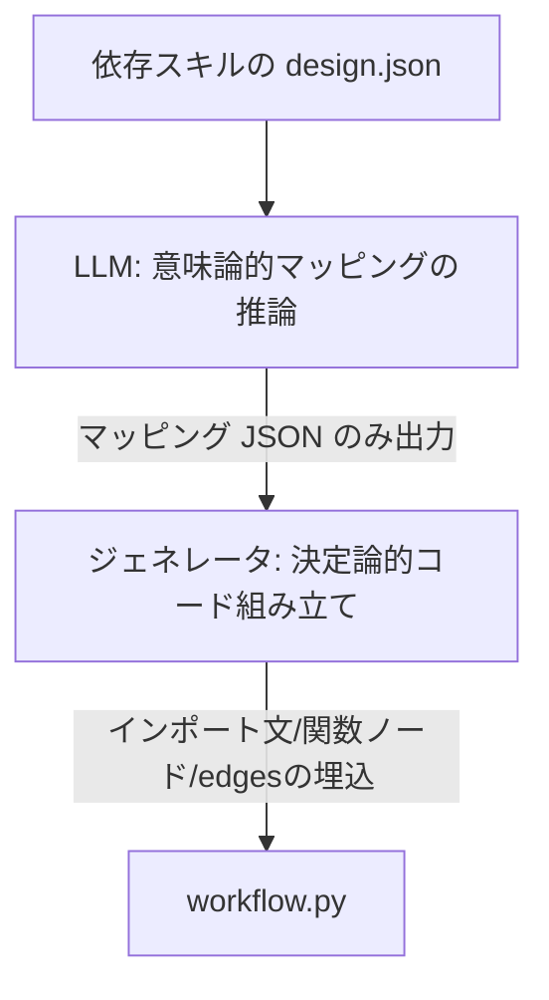

# ワークフロー自動生成における設計思想とアーキテクチャ

本ドキュメントでは、ADK 2.0 互換のワークフローモジュール（`module_type: workflow`）を自動生成する際に `skill-coder` が採用している**「事前ビルド型セマンティックマッピング生成」**の設計思想およびアーキテクチャについて解説します。

---

## 1. 事前ビルド（Ahead-of-Time Compilation）という思想

ワークフロー内の各ステップ（各子スキル）を繋ぐ際、最大の課題となるのが**「スキル間における入出力引数の解決（マッピング）」**です。スキルごとに引数の名前（例: `existing_design_path` と `design_path` など）や型が異なるため、これらを何らかの方法で適合させる必要があります。

本アーキテクチャでは、この解決を「実行時（Runtime）」ではなく、**「生成時（Coding/Build時）」に事前ビルドして固定化するアプローチ**を採用しています。

### 実行時解決（Just-in-Time）との対比

| 項目 | 実行時解決（LLMエージェント仲介） | 生成時解決（事前ビルド型コード出力） [採用] |
| :--- | :--- | :--- |
| **解決のタイミング** | ワークフローを実行するたびに、毎回 LLM が文脈を読んで引数を解決する。 | `skill-coder` 実行時に、LLM が一度だけマッピング関係を推論し Python コードを書き出す。 |
| **実行時の遅延 (Latency)** | 各ステップのたびに LLM 呼び出しが走るため、数秒〜十数秒の遅延が発生。 | **ゼロ。単なる Python の変数代入式として瞬時に実行される。** |
| **実行時の API コスト** | 実行回数に比例して LLM トークンコストが累積する。 | **ゼロ。生成時の 1 回のみのコストで固定される。** |
| **堅牢性** | 実行時の LLM のハルシネーションにより、稀にツール起動の失敗が起きる。 | **100% 決定論的。コンパイルされたコードが確実に実行される。** |

### 思想の核心
> **「スキーマの差異を吸収するためのセマンティック（意味論的）な推論にはLLMを使い、一度確定したマッピングは決定論的な Python コードとして書き下す。実行時はLLMを一切介さず、最速・最小コストで動作させる。」**
> 
> これにより、引数解決の柔軟性を極限まで保ちながら、本番実行時のパフォーマンスを最大化することができます。

---

## 2. 引数マッピングによる LLM 責務の最小化

もう一つの重要思想が、**「LLM に Python コードそのものを書かせない（責務の分離）」**という点です。

初期の設計では、プロンプト指示（注意書き）に「有向グラフ（edges）の繋ぎ方」「インプロセスでのモジュールインポート方法」「JSONのパース処理」など、ADK 2.0 の複雑な規約や Python の文法制約を大量に含めて LLM にコード全体を書かせていました。しかしこれはコンテキスト汚染を引き起こし、構文エラーや edges 接続の不整合などのハルシネーションを招く不安定な設計でした。

本アーキテクチャでは、LLM の責務を **「セマンティックなパラメータマッピング（JSON）の推論のみ」** に極小化しています。

### 役割の分離構造



1. **LLMの責務（セマンティック推論に特化）**
   - 依存する各スキルの `design.json` （説明文）を比較し、`tool_context.state` 内のどの状態キーを各スキルの入力引数にマップすべきかを決定し、単純な JSON 辞書（マッピング定義）として出力する。
2. **プログラム（ジェネレータ）の責務（100%決定論的）**
   - `code_generator.py` がその JSON をロードし、`SkillsState` からの動的ロードコード、関数ノードのボイラープレート定義、および最後の `"END"` を排除した edges の接続グラフを、文字列操作テンプレートによってバグの混入余地なく組み立てて出力する。

### 導入効果
- **ハルシネーションの排除**: Python のインデントエラー、未クローズの括弧、 edges のバリデーションエラーなどが仕組み上 100% 発生しなくなりました。
- **プロンプトの最小化**: プロンプト内の制約記述が極限まで削られ、トークン消費の削減と LLM の推論精度の向上が同時に達成されました。

---

## 3. 発展課題：データ変形・変換ロジックへの対応

マッピング時に「パスから親ディレクトリを取得する」「数値を演算する」などの**データ変換（変形）**が発生する場合の設計方針です。

### 短期方針：Python 式の許容（アプローチ A）
LLMが生成するマッピング JSON の値として、単純なキー名だけでなく **Python の短い代入式**（例: `"os.path.dirname(tool_context.state.get('design_path'))"` や `"tool_context.state.get('value') * 2"`）の出力をプロンプト上で許容します。
ジェネレータは、値に `tool_context` や演算子が含まれる場合は式（Expression）であると判定し、そのまま Python コードの代入式の右辺としてレンダリングします。これにより、LLMのプロンプトを長大化させることなく柔軟な変換を自動コード化できます。

### 長期ロードマップ：変換処理のモジュール化によるハイブリッド設計（アプローチ B への拡張）
将来的に、変形やパス計算などの「複雑な手続きロジック」が多く発生する場合は、それら自体をワークフロー側のマッピングコードに直接書かせるのではなく、以下のような形で**アプローチ B（ロジックの分離）に近いハイブリッド形式**へ拡張します。

1. **データ解決専用のミニスキル/ヘルパーノードの導入**:
   データ変形ロジックをカプセル化した「パス解決スキル」や「計算用ノード」をワークフローの中間ステップとして定義し、状態（`state`）を事前計算して更新します。
2. **マッピング定義のクリーン化**:
   これによって、最終的に各ツールへ値を渡すワークフローマッピングコード自体は、常に「前段の出力を後段 of 入力にそのまま渡す」という極めてシンプルな 1 対 1 のキー対応のみに保ち、高い可読性と安全性を維持し続けます。

---

## 4. 長期発展：複数ノード種別（関数・エージェント）と多段階生成

さらに高度なワークフローを構築するため、既存スキルの呼び出しだけでなく、**「単純な Python 処理（関数ノード）」** や **「LLMによる自律推論タスク（エージェントノード）」** をワークフローの一部として統合できるステップ定義へ拡張します。

### 設計書のステップ拡張 (`design.json`)
`steps` リスト内に各ノードの種別（`skill`, `function`, `agent`）を定義可能にします。

```json
  "steps": [
    { "name": "designer", "type": "skill", "target": "skill-designer" },
    { "name": "log_status", "type": "function", "description": "進捗をコンソールへ標準出力する Python 関数ノード" },
    { "name": "code_reviewer", "type": "agent", "description": "バグや設計違反をLLMが自律レビューするエージェントノード" }
  ]
```

### 多段階 LLM 生成（Multi-Stage Generation）
ジェネレータは、この設計書に基づいて **3 段階の LLM 処理**を連携させてコードを生成します。

1. **【第 1 段階】個別ノードロジックの出力**
   * `type: "function"` や `type: "agent"` のステップについて、その詳細説明（description）から「Python の具体的な内部処理ロジックコード」を Gemini API を使って局所的に個別自動生成します。
2. **【第 2 段階】セマンティック引数マッピング辞書の出力**
   * 全ステップの入出力関係をコンテキストに含め、Gemini に「全体の状態と各ステップパラメータ間の JSON マッピング定義」を推論させます。
3. **【第 3 段階】決定論的な組み立て**
   * 一般的なジェネレータが、第1段階で生成されたロジックコードと、第2段階のマッピング JSON を、ADK 規約に基づく `workflow.py` テンプレートの中にはめ込み、 edges 接続を含めて 100% 決定論的に組み立てて出力します。

これで、最も安全なお作法の中で、多様なロジックが組み合わさった高度なエージェントワークフローを完全に自律生成させることが可能になります。

---

## 5. 接続定義と実体ノードの完全物理分離（Decoupled Workflow and Nodes Architecture）

ADK 2.0 に準拠したワークフロー開発において、LLM エージェント（ハルシネーション）によるコード破損を防ぎつつ、自由なカスタマイズ性能を両立させるため、**「接続定義（workflow.py）」と「ノード実体（nodes/）」の物理的な完全分離** を採用しています。

### 構造の分離設計

* **接続定義 (`workflow.py`) [100% 決定論的・編集禁止]**:
  * グラフ（エッジ）の接続構造のみを定義するインデックスファイルです。
  * `nodes/` 以下のファイルをインポートして `Workflow` オブジェクトを構築するコードのみを生成器が書き出し、LLM によるアドホックな書き換え（例えば、無効な文字列 `"END"` の挿入など）を一切禁止します。
* **実体ノード (`scripts/nodes/`) [カスタマイズ可能]**:
  * 他スキル呼び出し（`type: "skill"`）も含め、すべてのノードの具体的な実行・引数マッピング処理を `scripts/nodes/<step_name>.py` に物理分離して追い出します。
  * エージェント（LLM）がステップの実行ロジックやデータパース処理をカスタマイズ・改修したい場合は、`workflow.py` を弄るのではなく、この `nodes/` 配下の個別ファイルのみを編集させます。

---

## 6. 物理的ガードレールと自己回復（Safe Tools & Self-Healing）

AI エージェントに対する注意事項（プロンプト）を増やしすぎると、コンテキストの汚染とハルシネーションを招きます。本アーキテクチャでは、プロンプトに頼るのではなく、**ツールレベルで物理的な安全境界を設定する**アプローチを実装しています。

* **編集制限ツール (`SafeWriteFileTool` / `SafeEditFileTool`)**:
  * 共通パッケージ `edd-agent-tools` 側で、指定された禁止ファイル（`workflow.py`, `handler.py`, `models.py`, `__init__.py` など）への書き込み・編集操作をシステムレベルで遮断する安全なツールを提供します。
* **エラーハンドリングによる自己回復 (Self-Healing)**:
  * エージェントがハルシネーションを起こして禁止ファイル（例: `workflow.py`）を書き換えようと試みた場合、ツールは `{'status': 'error', 'error': 'Writing to workflow.py is strictly prohibited'}` を返します。
  * この明確なエラーメッセージを受け取ったエージェントは、「直接の編集は禁止されている」と認識し、自己修正（Self-Healing）を行い、安全なアプローチ（個別ノードファイルの編集など）へ自動的に切り替えます。

---

## 7. 依存スキルの決定論的自動マッピングと個別関数呼び出し

他スキル呼び出しノードを決定論的に自動生成する際、下流スキルの**「個別引数を持つ具象関数（例: `test_dummy_skill(...)`）」を直接呼び出す疎結合なコード**を自動生成します。

1. **個別引数の動的マッピングと自動補完**:
   * 生成器（`workflow_generator.py`）は、対象ステップが依存するスキルの `design.json` を動的にロードし、入力パラメータ（`parameters`）のリストをスキャンします。
   * 明示的なマッピング（`inputs`）がない場合でも、自動的に `tool_context.state.get("<param_name>")` から値を取得して個別引数として関数に引き渡すコードを補完して組み立てます。
2. **戻り値（具象Outputモデル）の動的な解決と自動マージ**:
   * 呼び出し先スキルから返されるオブジェクト `res` は、共通の接続マージヘルパーである `merge_result_to_state(tool_context, res)` にそのまま渡されます。
   * このヘルパー関数が、`res` が `BaseModel`（Pydanticモデル）のインスタンスであることを動的に検知し、内部で `res.model_dump()` を行って `state` へマージします。
   * これにより、呼び出し元（各ノード）には下流スキルの `Output` スキーマクラスをインポートしたり、その型に直接依存する記述が一切不要になり、モジュール間の依存関係を極小化した完全な疎結合（ダックタイピング）が達成されます。循環インポートの問題も根絶されます。
