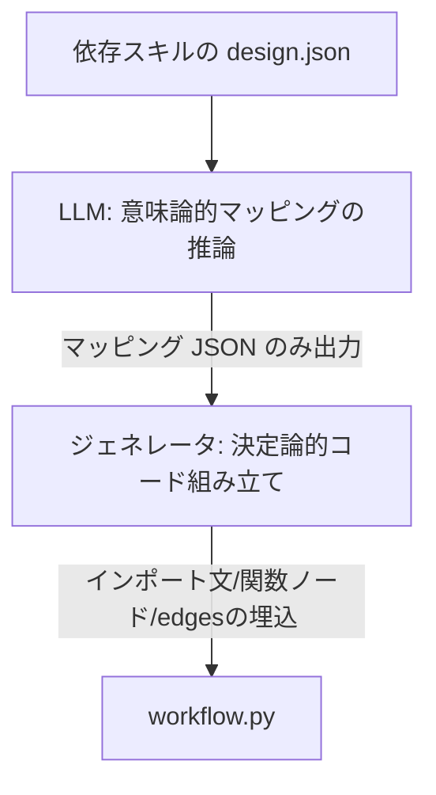

# ワークフロー自動生成における設計思想とアーキテクチャ

本ドキュメントでは、ADK 2.0 互換のワークフローモジュール（`module_type: workflow`）を自動生成する際に `skill-coder` が採用している**「事前ビルド型セマンティックマッピング生成」**の設計思想およびアーキテクチャについて解説します。

---

## 1. 事前ビルド（Ahead-of-Time Compilation）という思想

ワークフロー内の各ステップ（各子スキル）を繋ぐ際、最大の課題となるのが**「スキル間における入出力引数の解決（マッピング）」**です。スキルごとに引数の名前（例: `existing_design_path` と `design_path` など）や型が異なるため、これらを何らかの方法で適合させる必要があります。

本アーキテクチャでは、この解決を「実行時（Runtime）」ではなく、**「生成時（Coding/Build時）」に事前ビルドして固定化するアプローチ**を採用しています。

### 実行時解決（Just-in-Time）との対比

| 項目 | 実行時解決（LLMエージェント仲介） | 生成時解決（事前ビルド型コード出力） [採用] |
| :--- | :--- | :--- |
| **解決のタイミング** | ワークフローを実行するたびに、毎回 LLM が文脈を読んで引数を解決する。 | `skill-coder` 実行時に、LLM が一度だけマッピング関係を推論し Python コードを書き出す。 |
| **実行時の遅延 (Latency)** | 各ステップのたびに LLM 呼び出しが走るため、数秒〜十数秒の遅延が発生。 | **ゼロ。単なる Python の変数代入式として瞬時に実行される。** |
| **実行時の API コスト** | 実行回数に比例して LLM トークンコストが累積する。 | **ゼロ。生成時の 1 回のみのコストで固定される。** |
| **堅牢性** | 実行時の LLM のハルシネーションにより、稀にツール起動の失敗が起きる。 | **100% 決定論的。コンパイルされたコードが確実に実行される。** |

### 思想の核心
> **「スキーマの差異を吸収するためのセマンティック（意味論的）な推論にはLLMを使い、一度確定したマッピングは決定論的な Python コードとして書き下す。実行時はLLMを一切介さず、最速・最小コストで動作させる。」**
> 
> これにより、引数解決の柔軟性を極限まで保ちながら、本番実行時のパフォーマンスを最大化することができます。

---

## 2. 引数マッピングによる LLM 責務の最小化

もう一つの重要思想が、**「LLM に Python コードそのものを書かせない（責務の分離）」**という点です。

初期の設計では、プロンプト指示（注意書き）に「有向グラフ（edges）の繋ぎ方」「インプロセスでのモジュールインポート方法」「JSONのパース処理」など、ADK 2.0 の複雑な規約や Python の文法制約を大量に含めて LLM にコード全体を書かせていました。しかしこれはコンテキスト汚染を引き起こし、構文エラーや edges 接続の不整合などのハルシネーションを招く不安定な設計でした。

本アーキテクチャでは、LLM の責務を **「セマンティックなパラメータマッピング（JSON）の推論のみ」** に極小化しています。

### 役割の分離構造

1. **LLMの責務（セマンティック推論に特化）**
   - 依存する各スキルの `design.json` （説明文）を比較し、`tool_context.state` 内のどの状態キーを各スキルの入力引数にマップすべきかを決定し、単純な JSON 辞書（マッピング定義）として出力する。
2. **プログラム（ジェネレータ）の責務（100%決定論的）**
   - `code_generator.py` がその JSON をロードし、`SkillsState` からの動的ロードコード、関数ノードのボイラープレート定義、および最後の `"END"` を排除した edges の接続グラフを、文字列操作テンプレートによってバグの混入余地なく組み立てて出力する。

### 導入効果
- **ハルシネーションの排除**: Python のインデントエラー、未クローズの括弧、 edges のバリデーションエラーなどが仕組み上 100% 発生しなくなりました。
- **プロンプトの最小化**: プロンプト内の制約記述が極限まで削削され、トークン消費の削減と LLM の推論精度の向上が同時に達成されました。

---

## 3. 発展課題：データ変形・変換ロジックへの対応

マッピング時に「パスから親ディレクトリを取得する」「数値を演算する」などの**データ変換（変形）**が発生する場合の設計方針です。

### 短期方針：Python 式の許容（アプローチ A）
LLMが生成するマッピング JSON の値として、単純なキー名だけでなく **Python の短い代入式**（例: `"os.path.dirname(tool_context.state.get('design_path'))"` や `"tool_context.state.get('value') * 2"`）の出力をプロンプト上で許容します。
ジェネレータは、値に `tool_context` や演算子が含まれる場合は式（Expression）であると判定し、そのまま Python コードの代入式の右辺としてレンダリングします。これにより、LLMのプロンプトを長大化させることなく柔軟な変換を自動コード化できます。

### 長期ロードマップ：変換処理のモジュール化によるハイブリッド設計（アプローチ B への拡張）
将来的に、変形やパス計算などの「複雑な手続きロジック」が多く発生する場合は、それら自体をワークフロー側のマッピングコードに直接書かせるのではなく、以下のような形で**アプローチ B（ロジックの分離）に近いハイブリッド形式**へ拡張します。

1. **データ解決専用のミニスキル/ヘルパーノードの導入**:
   データ変形ロジックをカプセル化した「パス解決スキル」や「計算用ノード」をワークフローの中間ステップとして定義し、状態（`state`）を事前計算して更新します。
2. **マッピング定義のクリーン化**:
   これによって、最終的に各ツールへ値を渡すワークフローマッピングコード自体は、常に「前段の出力を後段の入力にそのまま渡す」という極めてシンプルな 1 対 1 のキー対応のみに保ち、高い可読性と安全性を維持し続けます。

