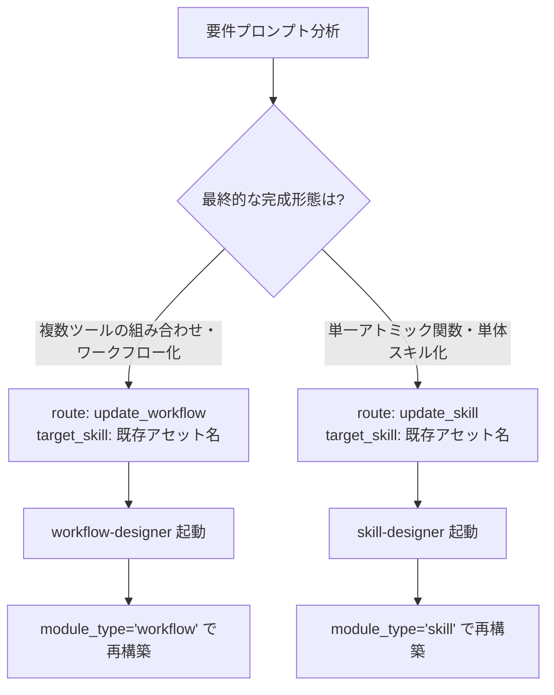

# skill-planner 開発計画・ルーティングアーキテクチャ (Planning & Routing Architecture)

本ドキュメントは、`skill-planner` における開発要件の分類、ルーティング判定アルゴリズム、および既存スキルの形態変化（マイグレーション）に関するアーキテクチャ規約を定義する専門リファレンスです。

---

## 1. 最前段ルーターの役割と関心の分離 (Separation of Concerns)

自律開発パイプライン（`skill-developer`）において、最前段に配置される `skill-planner` は以下の責務を一元管理します。

* **分析・判断の集約**:
  自然言語で与えられた機能要件プロンプトと既存のスキルインベントリをセマンティックに比較し、開発ルートを「5つの分岐」に明確に分類します。
* **暗黙推測の排除と明示的コンテキスト伝播**:
  下流のデザイナー（`skill-designer` や `workflow-designer`）が自前で曖昧な既存スキル参照検索を行わないよう、更新対象スキル名 (`target_skill`) を確定して後続の共有状態 (`tool_context.state`) に明示的に渡します。

---

## 2. 5つのルーティング分岐定義 (5-Route Taxonomy)

| ルート名 (`route`) | 分類名 | 判定条件 | 主な動作 |
|---|---|---|---|
| **`create_skill`** | 新規単体スキル作成 | 既存インベントリに存在しない自己完結型のアトミックな新規機能 | `target_skill=None` で `skill-designer` 起動 |
| **`create_workflow`** | 新規ワークフロー作成 | 既存インベントリに存在しない複数ツールのオーケストレーション新規機能 | `target_skill=None` で `workflow-designer` 起動 |
| **`update_skill`** | 既存アセットの単体スキル化更新 | 既存スキル/ワークフローの改修で、**最終成果物を単体スキル (`module_type="skill"`) として完成・集約させる場合** | `target_skill="既存名"` で `skill-designer` 起動 |
| **`update_workflow`** | 既存アセットのワークフロー化更新 | 既存スキル/ワークフローの改修で、**最終成果物をワークフロー (`module_type="workflow"`) として完成・昇格させる場合** | `target_skill="既存名"` で `workflow-designer` 起動 |
| **`proposal`** | 事前スキル開発提案 | 開発要件が大きすぎ前提となる基礎技術が不足している場合 | 事前スキルの情報を提案し、ワークフローを安全に中断 |

---

## 3. 形態変化（Skill ⇄ Workflow マイグレーション）の判定基準

既存スキルの改修・リファクタリングにおいて、機能の複雑化や単純化に伴う構造転換（マイグレーション）を以下のように決定論的に判定します。

### 判定原則: 「完成後の姿 (Target Output Form)」
`update_skill` と `update_workflow` の判定基準は、**「更新前の元の形態」ではなく「更新後（最終成果物）として目指す形態 (`module_type`)」** です。

1. **昇格（Skill ➔ Workflow）**:
   単体スキル（例: `my-tool`）が複数ステップのパイプラインに拡張される場合、`route: update_workflow`, `target_skill: "my-tool"` と判定され、[workflow-designer](file:///workspace/src/skills/workflow-designer) によって `module_type="workflow"` の設計書へ昇格置換されます。
2. **統合・抽象化（Workflow ➔ Skill）**:
   ワークフロー（例: `my-flow`）が整理されてアトミックな1関数に集約される場合、`route: update_skill`, `target_skill: "my-flow"` と判定され、[skill-designer](file:///workspace/src/skills/skill-designer) によって `module_type="skill"` の設計書へ集約置換されます。
