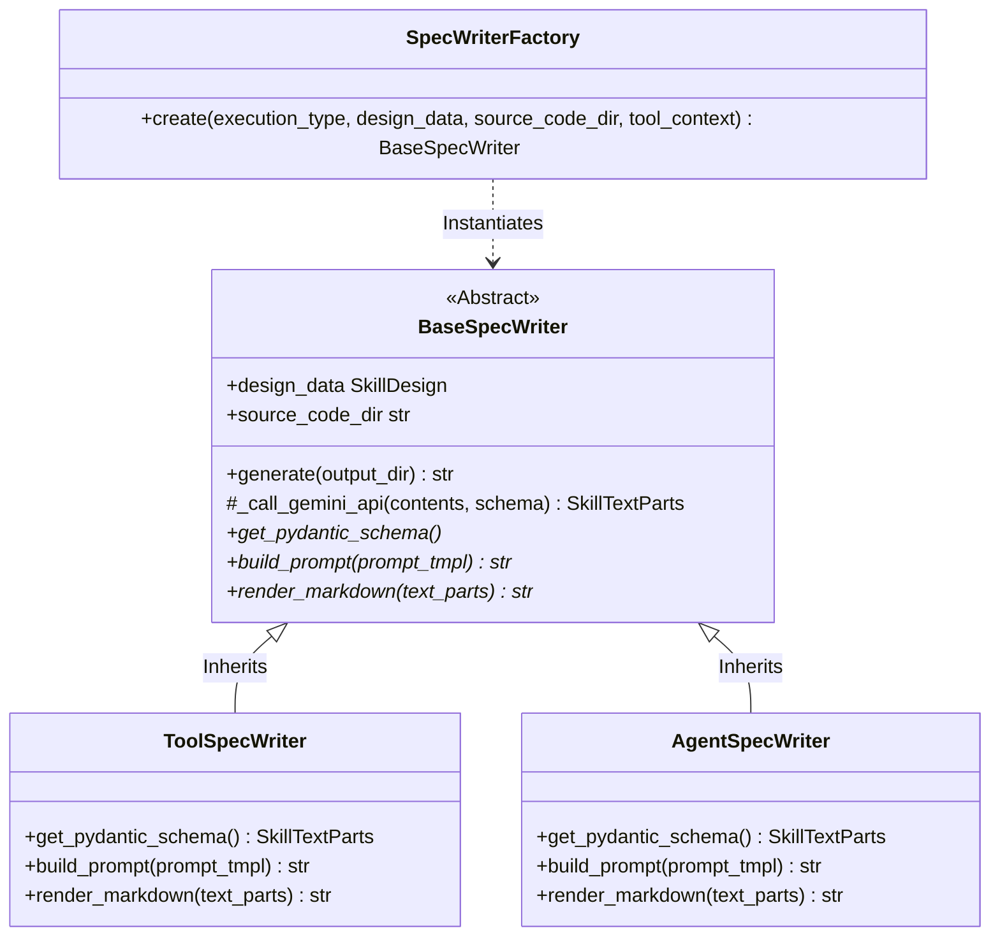

# skill-spec-writer アーキテクチャ設計書

本ドキュメントは、仕様書自動生成スキルである `skill-spec-writer` の全体構造、採用しているデザインパターン、およびコードベースの拡張性を維持するための設計思想についてまとめたものです。

---

## 1. 全体アーキテクチャ概要

`skill-spec-writer` は、対象となるスキルの設計データ（`design.json`）とソースコードを読み込み、Gemini API を用いてセマンティックな情報を抽出しつつ、決定論的かつ一貫した Markdown 仕様書（`SKILL.md`）を出力するスキルです。

システムは以下の主要コンポーネントで構成されています。

---

## 2. 適用されているデザインパターン

堅牢性と拡張性を確保するため、オブジェクト指向設計の古典的なデザインパターンを採用しています。

### ① Factory Pattern（ファクトリ・パターン）
* **該当クラス**: `SpecWriterFactory` ([factory.py](file:///workspace/src/skills/skill-spec-writer/scripts/writer/factory.py))
* **採用理由**:
  スキルの実行形式である `execution_type` (`"tool"` または `"agent"`) によって、仕様書の生成プロセスやプロンプト指示、レンダリング方法が大きく異なります。
  呼び出し側（`spec_writer.py`）が個別の具象ライタークラスの存在やインスタンス化ロジックを直接知る必要をなくし、オブジェクトの作成責務を完全にカプセル化しています。
* **なぜタイプを分けるのか（ADK/Playbooksの思想背景）**:
  ADKおよびGoogle Cloud Conversational Agents（Playbooks）のアーキテクチャ設計では、エージェントが利用するツール（スキル）の責責について、**「決定論的（確定・安定）な処理」**と**「非決定論的（自律思考・推論）な処理」**を技術的・概念的に厳格に分離しています。
  * **`tool` タイプ (`PythonFunction` / `ClientFunction` 等の具象)**:
    * **目的**: ファイルI/OやAPIリクエストなどの「決定論的なシステム操作」を、安全かつ確実に実行させるための概念です。エージェント（LLM）自身に操作手順を考えさせるのではなく、プログラムコードで機械的に完結させるため、厳密な引数定義と手順書の自動出力が必要になります。
  * **`agent` タイプ (`AgentTool` / `Sub-Agent` の具象)**:
    * **目的**: 複雑な課題（設計、コーディングなど）を、別の「LLMによる自律思考を持ったエージェント（Playbook）」へ委譲するための概念です。エージェントの中に別のエージェントをネストさせるため、引数の受け渡しだけでなく「思考のステップや方針（Instructions）」にフォーカスした仕様定義が必要です。
  * **仕様書を読み込むAIエージェントのトークン消費と注意力の最適化**:
    AIエージェントが利用可能なスキル群から適切なものを選択・実行する際、各スキルの仕様書（`SKILL.md`）をシステムプロンプト（コンテキスト）としてロードします。この際の**AIのトークン消費量の最小化**と、**適切な役割認識（アテンションの制御）**がタイプ分割の核心的な理由です。
    * **`tool` スキルを読み込む時**: AIは「関数のインターフェース（正しい引数と返り値の型）」だけを正確に理解できれば十分です。もしここに無駄な思考指示やプロンプトが含まれていると、AIは**無関係な情報にコンテキストトークンを浪費し、アテンション（注意力）が散漫になってパラメータ設定エラーを引き起こします。**
    * **`agent` スキルを読み込む時**: AIは「そのサブエージェントがどのような思考指示（Instructions）に沿って自律的に推論するか」を理解する必要があります。仕様書に思考プロセスが明記されていることで、AIはこれが「機械的なツール」ではなく「仕事を委譲すべき自律的なエージェント」であると正しく認識し、適切なコンテキストを渡して委譲できるようになります。
  * **リファレンスリンク**:
    * ADK 公式スキル設計ガイド: [Skills for ADK agents](https://adk.dev/skills/index.md)
    * ADK 公式エージェント設計ガイド: [Simple agents](https://adk.dev/agents/llm-agents/index.md)
    * Google Cloud Playbooks Tools 概念詳細: [playbooks_tools_concept.md](file:///workspace/src/skills/skill-spec-writer/references/playbooks_tools_concept.md)
* **出力内容およびプロンプトの違い**:
  * **`tool` タイプ (決定論的スクリプト型)**:
    * **特性**: AI自身が推論するのではなく、入力引数を受け取って Python などのスクリプト処理を完結させるツール。
    * **仕様書の内容**: 「厳格な入力パラメータの型・必須チェック」や「スクリプトとしての具体的な関数・CLI実行手順」にフォーカスした内容を出力します。
    * **抽出プロンプト**: スクリプトの機械的な実行手順や、引数チェックロジックの流れを箇条書きステップとして抽出させます。
  * **`agent` タイプ (LLM自律思考型)**:
    * **特性**: スキル内部に自律推論用のプロンプト（`prompt.txt` 等）を持ち、LLM自身が思考指示に従って生成を行うスキル。
    * **仕様書の内容**: 「エージェントが思考テンプレートをロードして実行する手順」や、エージェントが辿る「論理的な推論思考プロセス」にフォーカスした内容を出力します。
    * **抽出プロンプト**: LLMが思考指示ステップ（assets/prompt.txt）に沿ってどのように自律推論を実行するかのプロセスを抽出させます。

### ② Template Method Pattern（テンプレートメソッド・パターン）
* **該当クラス**: `BaseSpecWriter` ([base.py](file:///workspace/src/skills/skill-spec-writer/scripts/writer/base.py))
* **採用理由**:
  「共通アセットのロード ➔ プロンプトの組み立て ➔ Gemini APIの呼び出しとJSONパース ➔ ディレクトリ作成とファイル書き込み」という**仕様書生成のライフサイクル（アルゴリズムの骨格）は、すべての実行タイプで共通**です。
  `BaseSpecWriter.generate()` メソッドでこの不変の共通アルゴリズムを一元定義し、バリエーションが生じる「スキーマの返却（`get_pydantic_schema`）」「プロンプト構築（`build_prompt`）」「Markdownレンダリング（`render_markdown`）」のみを具象クラスでオーバーライド（実装）させることで、コードの重複（DRY）を排除しています。

---

## 3. 拡張性の担保（Open-Closed Principle）

本設計は、オブジェクト指向設計原則の一つである「開閉原則（拡張に対して開いており、修正に対して閉じている）」を体現しています。

もし将来、ADKに新しい実行形式（例: ワークフロー全体の自動遷移を制御する `"workflow"` タイプなど）が追加された場合、既存の `ToolSpecWriter` や `AgentSpecWriter` のコードを一切変更することなく、以下の2ステップだけで安全に拡張できます。

1. `BaseSpecWriter` を継承した `WorkflowSpecWriter` を新規作成する。
2. `SpecWriterFactory` に `"workflow"` のマッピング分岐を1行追加する。

---

## 4. データ抽出とバリデーション

Gemini APIの呼び出しにおいて、Pydantic v2モデルを直接スキーマとして引き渡し、かつ `json.loads` でパースした後に `model_validate` で型検証を行っています。
これにより、LLMの非決定論的な応答に対して、ランタイム時の強固な型安全性が保証されています。
