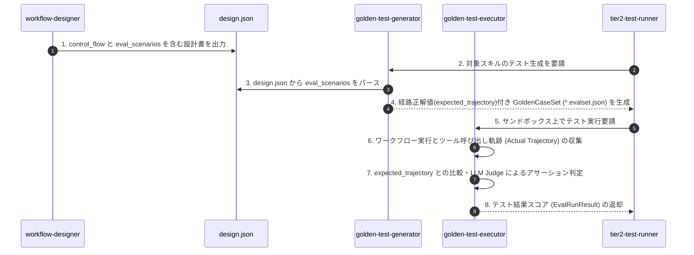

# ワークフロー設計構造（control_flow / eval_scenarios）とゴールデンテスト経路評価アーキテクチャ

本ドキュメントでは、ADK 2.0 互換のワークフロー設計書（`design.json`）における制御フロー構造（`control_flow`）および評価シナリオ（`eval_scenarios`）の設計仕様、ならびにそれらを活用したゴールデンテストにおける経路評価（Trajectory Evaluation）の実行アーキテクチャについて解説します。

---

## 1. 背景と目的 (Why)

従来の決定論的な単体機能（`SKILL`）とは異なり、複数のスキルや関数を動的に接続するワークフロー（`WORKFLOW`）の品質保証においては、最終出力（Output）の正しさだけではなく、**「意図した通りのステップ・ツール呼び出し経路（Trajectory）を正しい順序と引数で通過したか」** を評価することが不可欠です。

本アーキテクチャでは以下の目標を達成するために設計されています：

1. **設計書（`design.json`）の Single Source of Truth 化**:
   ワークフローの構成・制御フロー構造・正解実行経路（`expected_trajectory`）を `design.json` に集約・一元管理する。
2. **自動テストケース生成（`golden-test-generator`）の確定化**:
   `design.json` 内の `eval_scenarios` から、経路上で呼び出されるべきツールとパラメータの期待値を含むゴールデンテストセット（`*.evalset.json`）を確定的に自動生成する。
3. **アサーションの多角化（`golden-test-executor`）**:
   単なる最終回答のテキストマッチングに加え、ツールの呼び出し順序や引数の目的が適切に満たされているかを LLM-as-Judge およびシステムアサーションで判定する。

---

## 2. ワークフロー設計書 (`design.json`) のスキーマ仕様

ワークフローモジュール（`module_type: "workflow"`）の `design.json` には、`steps` フィールドに加えて、制御フローおよび評価シナリオが定義されます。

### 2.1 制御フロー構造 (`control_flow`)

ワークフロー内のノード間の遷移条件や有向グラフ（DAG / Routing）を明示します。

```json
"control_flow": {
  "start": "route-requirement",
  "nodes": {
    "route-requirement": {
      "target": "developer-router",
      "transitions": {
        "skill": "design-skill",
        "workflow": "design-workflow",
        "proposal": "handle-proposal"
      }
    },
    "design-skill": {
      "target": "skill-designer",
      "next": "code-skill"
    },
    "design-workflow": {
      "target": "workflow-designer",
      "next": "code-skill"
    },
    "code-skill": {
      "target": "skill-coder",
      "next": "write-spec"
    },
    "write-spec": {
      "target": "skill-spec-writer",
      "next": "finalize-assets"
    },
    "finalize-assets": {
      "target": null,
      "next": null
    }
  }
}
```

* **`start`**: ワークフローの起点となるステップの識別子名。
* **`nodes`**: ステップ名をキーとする辞書。
  * **`target`**: 呼び出す既存スキル名（または関数名）。
  * **`next`**: 分岐がない場合に次に実行する単一ステップ名。
  * **`transitions`**: 条件分岐における戻り値/状態に応じた分岐先マッピング辞書。

---

### 2.2 評価シナリオ構造 (`eval_scenarios`)

ワークフローの品質検証で使用する代表的なテストケース（入力プロンプトと正解経路のペア）を定義します。

```json
"eval_scenarios": [
  {
    "scenario_id": "single_skill_creation",
    "description": "単体スキルの要件定義から開発・仕様書生成までの一連フロー",
    "input": {
      "prompt": "URLからWebページのタイトルを抽出するスキルを作成してください"
    },
    "expected_trajectory": [
      {
        "name": "developer-router",
        "args": { "prompt": "URLからWebページのタイトルを抽出するスキルを作成してください" }
      },
      { "name": "skill-designer" },
      { "name": "skill-coder" },
      { "name": "skill-spec-writer" }
    ],
    "expected_final_status": "success"
  }
]
```

* **`scenario_id`**: テストケースを一意に識別する文字列 ID。
* **`description`**: テストシナリオの目的・説明。
* **`input`**: ワークフロー呼び出し時の入力パラメータ辞書。
* **`expected_trajectory`**: 期待されるツール呼び出しのシーケンスリスト（`name`: ツール名, `args`: パラメータ期待値）。
* **`expected_final_status`**: 最終実行結果の期待ステータス。

---

## 3. ゴールデンテスト・評価パイプラインとの連携

新規スキルの評価および Tier 2 昇格ゲートウェイ（`tier2-test-runner`）において、本設計情報は以下のように処理されます。



1. **`workflow-designer` の役割**:
   Pydantic モデル (`SkeletonDesign`) および指示プロンプトに従い、`control_flow` と `eval_scenarios` を含んだ `design.json` を生成。
2. **`golden-test-generator` の役割**:
   `design.json` の `eval_scenarios` から `expected_trajectory` を持つゴールデンテストケースデータ（`GoldenCase`）を確定生成。
3. **`golden-test-executor` の役割**:
   テスト実行時、最終出力に加えて `expected_trajectory` に基づいた呼び出し順序や引数のアサーション判定を実行。

---

## 4. 開発者向けまとめ

* **単体スキル (`SKILL`)**: 入出力アサーション（I/Oテスト）のみを行うため、`control_flow` および `eval_scenarios` は不要。
* **ワークフロー (`WORKFLOW`)**: 複数ノードの連携を検証するため、`design.json` に `control_flow` と `eval_scenarios` の定義を記述することがベストプラクティスです。
